# DB MoveOptimizer — Backend Architecture Report

**Scope:** the complete backend, from input to final output, with every component classified
as one of three kinds:

| Legend | Kind | What it means |
|:------:|------|---------------|
| 🟩 **DET** | Deterministic | Pure Python (engines) or a thin adapter/store (tools, session, orchestration). No LLM. The authoritative source of every euro / CO₂ / minute / trip number. |
| 🟨 **LLM-STEP** | Single structured-output LLM call | Exactly one model completion over a fixed payload, no tools. Predicts demand, judges free-text feasibility, or writes prose — never a figure. Each has a deterministic fallback. |
| 🟪 **AGENT** | Tool-using ReAct agent | One LLM that *autonomously* calls tools in a loop until it answers. There is exactly **one**: the Advisor. |

> **This report reflects the completed `pipeline_reengineering` migration (Phases A–E).**
> The backend is now three clean layers plus one agent: **pure `engines/`** (no LLM),
> **single-call `agent/llm_steps/`**, **thin `agent/tools/`**, and the **one `Advisor`
> agent** — over a **session** model. Every number comes from a deterministic engine; the
> LLM only narrates, forecasts demand, and judges plain-language feasibility.
>
> Verified against code at commit `c08d6a5` on 2026-07-17 (backend suite: 134 passing).

---

## Chapter 1 — Executive Overview

The backend is a **FastAPI** service with two surfaces. `POST /api/analyze` is a **plain
deterministic pipeline** that computes the numbers and opens a **session**. `POST
/api/chat/{session_id}` is the **one ReAct agent** (the Advisor): it delivers the opening
briefing (turn 0 — what used to be a separate memo) and answers every follow-up, grounded
in the session snapshot. State lives in **PostgreSQL 16**; **University GPT** is the LLM;
**Langfuse** is optional observability.

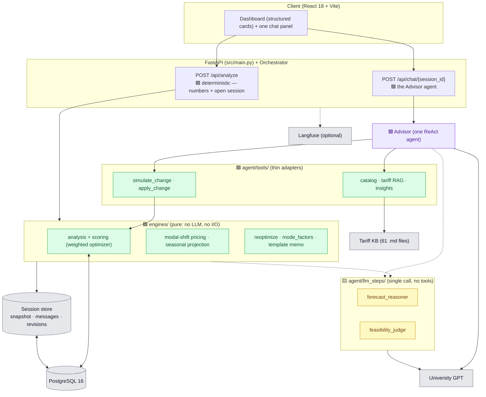

**Tech stack:** Python 3.12 · FastAPI + Uvicorn · psycopg2 → Postgres 16 · LangChain /
`langchain-openai` (LLM steps) · LangGraph `create_react_agent` (the Advisor) · Langfuse
(optional). No Redis, no vector DB.

**The one rule that keeps the taxonomy honest:** an "agent" runs a tool loop; everything
else is a pure engine (math), a single LLM step (one completion), or a thin tool (adapter).
By that rule the system has **one** agent, two LLM steps, a handful of tools, and pure
engines underneath.

---

## Chapter 2 — Inputs: what enters the system

The serving inputs are tiny. `/api/analyze` takes a **`user_id`**; `/api/chat` takes a
**`session_id`** + the message list. Everything else is pulled from Postgres by the one
canonical loader, [`agent/context.py::load_context`](../backend/src/agent/context.py) — the
"travel-history sandbox" is seeded DB data, not a live API.

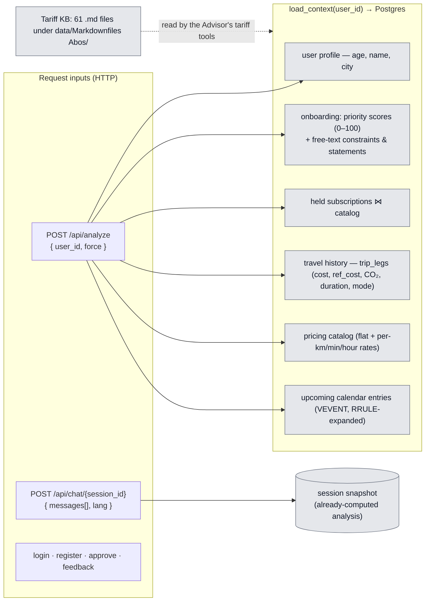

**Endpoint surface** (`src/main.py`):

| Method & path | Kind | Purpose |
|---|:---:|---|
| `POST /api/analyze` | 🟩 pipeline + 🟨 forecast/feasibility | Deterministic analysis; opens a session |
| `POST /api/chat/{session_id}` · `/stream` | 🟪 agent | Opening briefing (empty messages) + follow-ups |
| `POST /api/login` · `/api/register` | 🟩 | Shared-/hashed-password auth against seeded users |
| `GET /api/personas` | 🟩 | List seeded users + prefs + subs |
| `POST /api/recommendations/{id}/approve` | 🟩 | Approval + Langfuse acceptance score |
| `POST /api/feedback` | 🟩 | Chat thumbs → Langfuse score |
| `GET /api/analyst/{id}` · `/api/forecaster/{id}` · `POST /api/forecaster/test` | 🟩/🟨 | Per-stage debug endpoints |

`load_context` also returns the **free-text `onboarding_raw`** (constraints, travel/activity
statements), consumed by the modal-shift feasibility judge.

---

## Chapter 3 — The `/api/analyze` pipeline (🟩 deterministic + 2 LLM steps)

The backbone: plain sequential Python in [`agent/pipeline.py`](../backend/src/agent/pipeline.py),
wrapped by the [`Orchestrator`](../backend/src/orchestrator.py), which persists the result as
a **session snapshot** and shapes the frontend payload. **No memo LLM call** — the narrative
is the Advisor's turn 0.

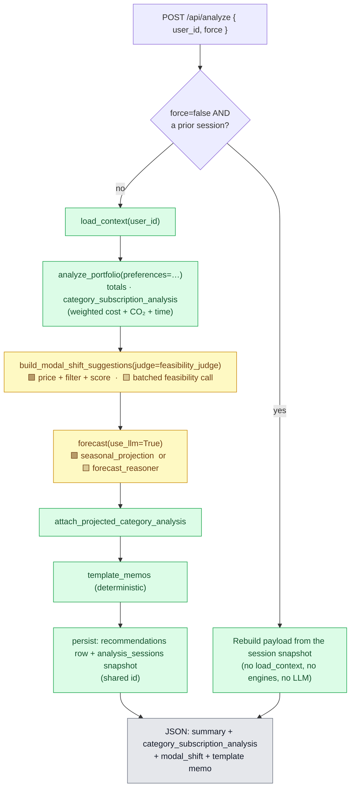

- **Numbers first.** `load_context`, `analyze_portfolio`, modal-shift pricing,
  `seasonal_projection` and `template_memos` are deterministic and produce every figure.
  **Two LLM steps** sit on the analyze path: modal-shift **feasibility** (a free-text
  judgment) and the **forecast reasoner** (demand scenarios). Neither computes money; each
  falls back deterministically. The memo LLM call is gone — the briefing is turn 0 (Ch 8).
- **Read-through cache = the session snapshot.** An unforced call rebuilds the dashboard
  payload from the snapshot alone — no `load_context`, no engines, no LLM.

---

## Chapter 4 — The Analysis engine (🟩 weighted optimizer)

[`engines/analysis.py`](../backend/src/agent/engines/analysis.py) ingests leg-level history +
held subs + the priced catalog + onboarding **preferences**, and emits
**`category_subscription_analysis`**: per travel category, *current vs. pay-as-you-go vs.
eligible alternatives*, each priced on **cost, CO₂ and time**, with the winner chosen by a
**preference-weighted score** ([`engines/scoring.py`](../backend/src/agent/engines/scoring.py)).
This is "the optimizer" — a deterministic function, no LLM.

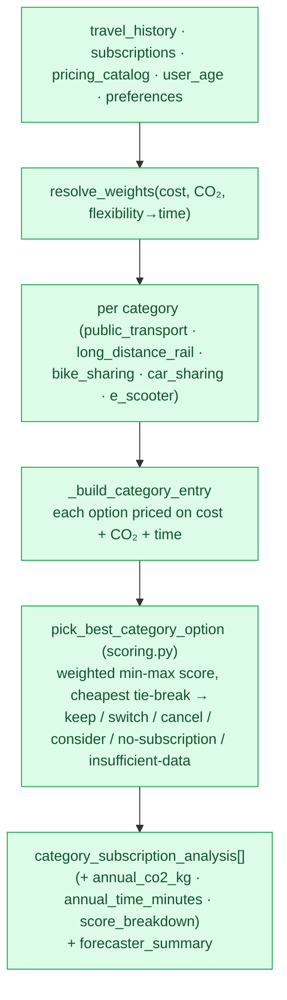

Design points: weighted multi-criteria (money→cost, emission→co2, flexibility→time), but
within a category the same physical trips happen regardless of which plan pays, so CO₂/time
barely vary and the score reduces to pure cost with an exact cheapest tie-break. Eligibility
guards (age bands, class matching, unverifiable plans) are unchanged. The shared six-verb
vocabulary is what makes the engine comparable to the LLM baseline (Ch 12).

---

## Chapter 5 — Cross-category modal shift (🟩 pricing + 🟨 feasibility)

[`engines/modal_shift.py`](../backend/src/agent/engines/modal_shift.py) asks the *other*
question: would shifting trips to a **different** transport category beat staying, on the
same weighted score? It is the first place CO₂/time and free-text onboarding actually change
an answer.

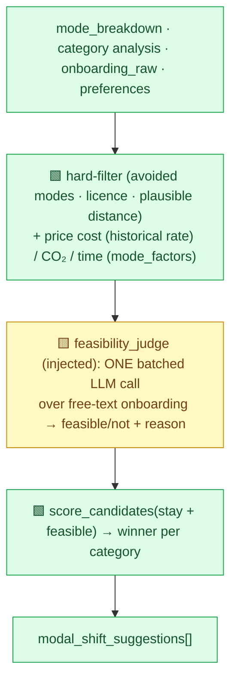

Money/CO₂/time stay deterministic (real historical rates + `mode_factors.py` tables); the
**feasibility judge is injected** (`judge=…`) so the engine itself is LLM-free — the LLM only
reads the user's own words to say whether a shift is realistic, and defaults to feasible/low
when unavailable.

---

## Chapter 6 — The `llm_steps/` layer (🟨 single calls, no tools)

[`agent/llm_steps/`](../backend/src/agent/llm_steps/) is the honest home for the "one
structured LLM call + deterministic fallback" pattern that used to live *inside* `engines/`.
Each is pure-in → pure-out, validated via `agent/json_extract.py`, with no tool loop.

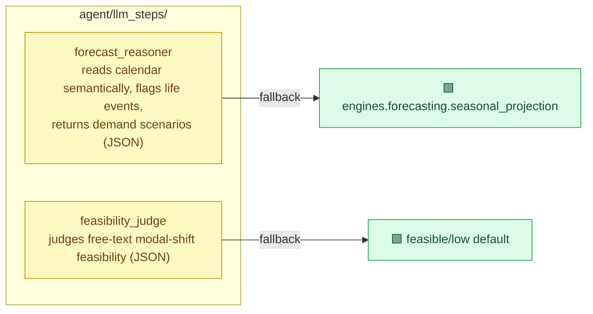

`engines/forecasting.py` is now a **pure `seasonal_projection`** (full-history monthly
average + same-month prior-year seasonal override); the LLM demand reasoning is
`forecast_reasoner`. The `engines/` package's "no LLM, no I/O" contract is true again
(guardrail: `engines/` imports no `agent.llm`).

---

## Chapter 7 — The Advisor agent (🟪 the one agent) — briefing + chat

[`agent/advisor/agent.py`](../backend/src/agent/advisor/agent.py) is the single
conversational surface, built with LangGraph's `create_react_agent`. It **delivers the
opening briefing (turn 0)** — the recommendation prose that used to be a separate memo — and
answers every follow-up, all grounded in the **session snapshot** (no DB re-query).

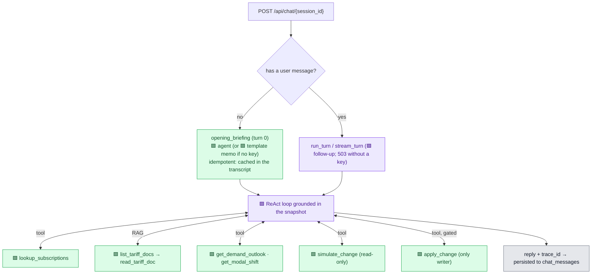

- **Memo = turn 0.** With no user message, the endpoint returns the opening briefing. It is
  **idempotent** — generated once per session and cached in `chat_messages`, so a dashboard
  re-mount reuses it (one LLM call per session). Without a key it falls back to the
  deterministic template memo, so a briefing always comes back.
- **One prompt** (`prompts/advisor_system.md`), one grounding (the snapshot), one RAG surface
  (the tariff tools). The old `communicator_agent` and its prompt are deleted; the memo
  writer `analyst_agent.py` is retained only for the eval experiment (Ch 12).

---

## Chapter 8 — Tools & the change flow (🟩) — simulate → confirm → apply

The Advisor's tools are all deterministic; the agent is an LLM reasoning layer over
deterministic capabilities. The plan-change flow is split by side-effect.

| Tool | File | What it does |
|---|---|---|
| `lookup_subscriptions` | [`tools/catalog.py`](../backend/src/agent/tools/catalog.py) | Read the live catalog |
| `list/read_tariff_doc` | [`tools/knowledge.py`](../backend/src/agent/tools/knowledge.py) | Agentic RAG over the tariff corpus |
| `get_demand_outlook` / `get_modal_shift` | [`tools/insights.py`](../backend/src/agent/tools/insights.py) | Surface the snapshot's precomputed forecast / modal-shift |
| `simulate_change` | [`tools/simulate.py`](../backend/src/agent/tools/simulate.py) | **Read-only** what-if |
| `apply_change` | [`tools/apply.py`](../backend/src/agent/tools/apply.py) | The **only** writer |

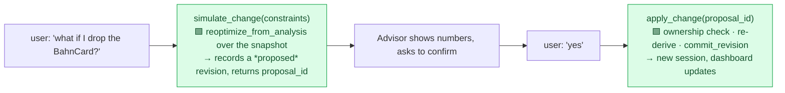

- **`simulate_change`** is read-only: it re-derives the verdict deterministically
  (`engines/reoptimize.py`, reusing the snapshot's already-priced alternatives and the same
  weights) and records a **`proposed`** revision (scratch — the dashboard is unchanged),
  returning a `proposal_id`.
- **`apply_change`** is the sole state-mutating tool. Confirmation is **structural**: it needs
  a `proposal_id` a prior `simulate_change` minted, verifies the proposal's **owner** matches
  the caller, re-derives against the proposal's snapshot, and persists via
  `session.commit_revision` (no `Orchestrator` import in a tool — guardrail).

*Note:* confirmation today is the simulate→proposal-id gate; a formal LangGraph
human-in-the-loop *interrupt* remains a future refinement (see the To-Be doc).

---

## Chapter 9 — Session model & persistence (🟩)

A fresh `/api/analyze` writes a **`recommendations`** row (approval trail) **and** an
**`analysis_sessions`** row (the full snapshot), sharing one id. The session is the
read-through source of truth; the Advisor grounds from it; chat turns and revisions attach to
it. [`agent/session.py`](../backend/src/agent/session.py) owns all of it.

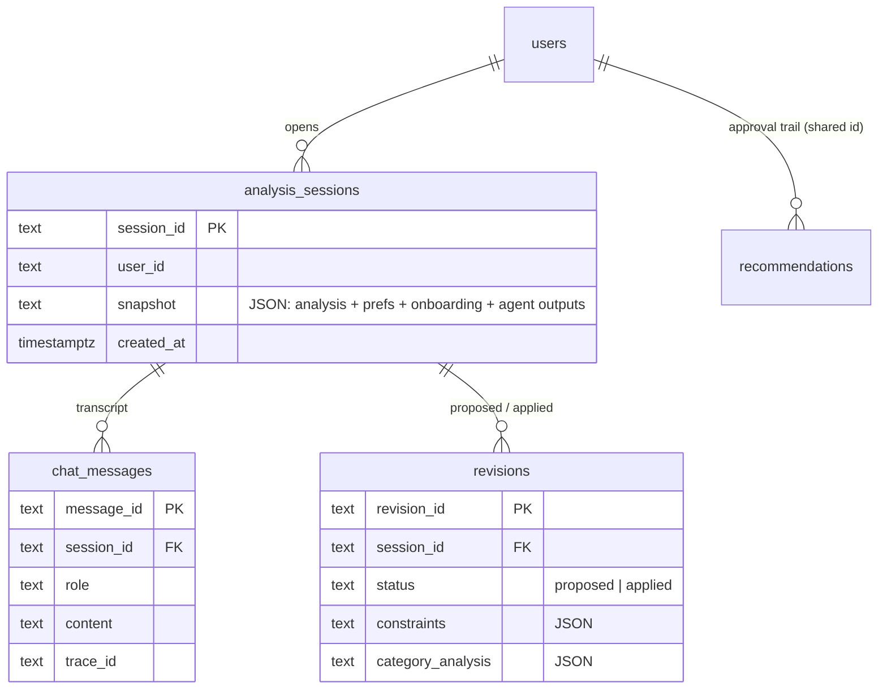

The snapshot carries everything to serve the dashboard and ground the agent without a
re-query: the agent outputs, preferences/weights, `onboarding_raw`, subscriptions, and the
display totals. Approval status is read live from the shared-id `recommendations` row so an
approved plan still shows approved. There is no Redis — the "cache" is the latest session.

---

## Chapter 10 — The tariff knowledge base & RAG (🟩 retrieval, no embeddings)

[`tools/knowledge.py`](../backend/src/agent/tools/knowledge.py) exposes the 61 tariff/AGB
markdown files under `data/Markdownfiles Abos/`. Retrieval is **navigation, not vectors** —
no embeddings, no similarity search; the file tree is the index.

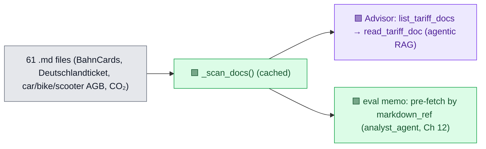

On the **production** path RAG is purely agentic (the Advisor navigates the corpus). The
deterministic *pre-fetch by `markdown_ref`* now lives only in the eval memo writer
(`analyst_agent._relevant_tariff_docs`).

---

## Chapter 11 — Cross-cutting: LLM access & observability

Two thin modules isolate the externals. [`agent/llm.py`](../backend/src/agent/llm.py) owns
the University GPT client and `llm_available()`. [`agent/observability.py`](../backend/src/agent/observability.py)
wraps Langfuse (traces, versioned prompts, scores) — **purely additive**: absent keys make
every trace/prompt/score a no-op.

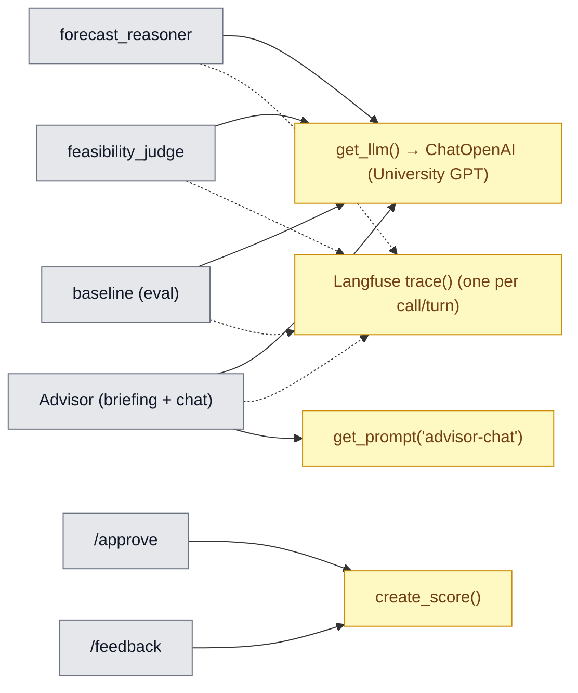

Graceful degradation on a runtime LLM error: forecast → seasonal projection, feasibility →
feasible/low, briefing → template memo, chat follow-up → 503 (frontend handles it).

---

## Chapter 12 — The evaluation harness (off the serving path)

A parallel, **non-serving** track. [`baseline_pipeline.py`](../backend/src/agent/baseline_pipeline.py)
is a single LLM call over the *raw* context (no engines, no number guard), emitting the same
six-verb vocabulary so both are scored on one rubric with the deterministic engine as ground
truth.

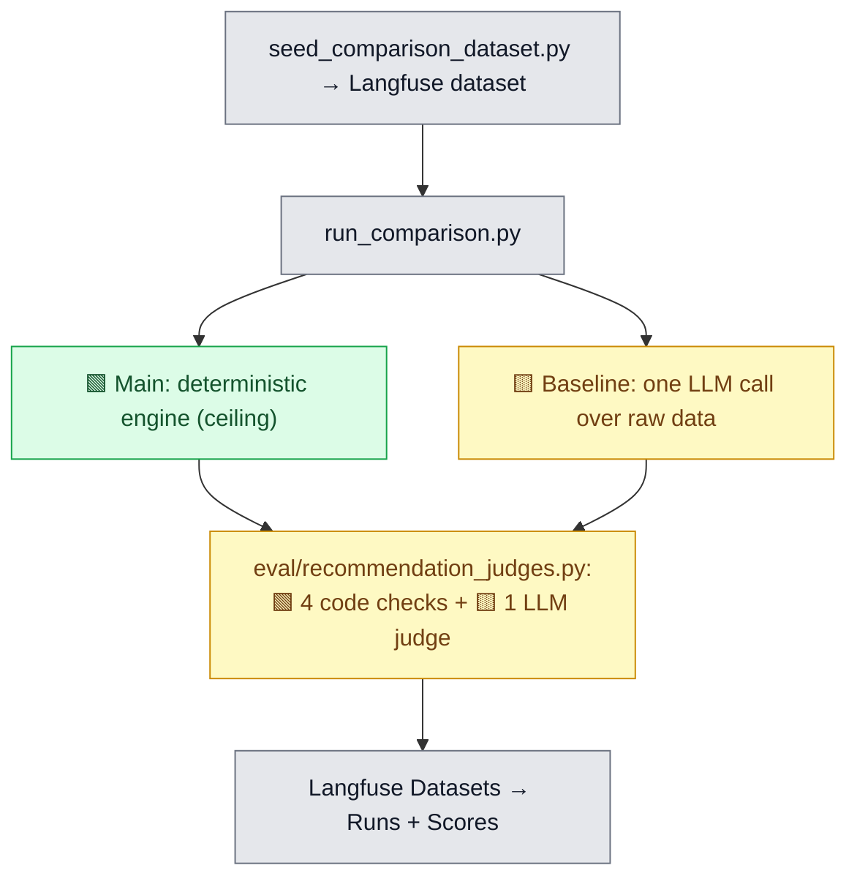

The eval track also still uses `analyst_agent.run_briefing` (the single-call memo writer, with
its deterministic tariff pre-fetch) — the only remaining caller of that module, kept off the
production path (`scripts/run_experiment.py`).

---

## Chapter 13 — Component taxonomy (the definitive classification)

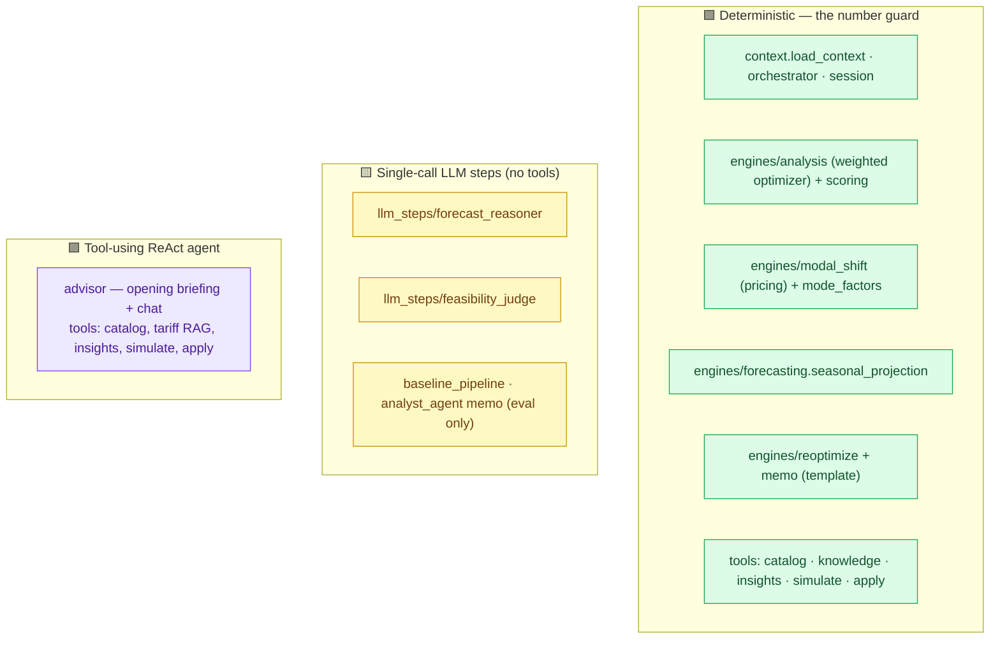

| Component | Kind | Tools? | RAG? | LLM calls | On-error fallback |
|---|:---:|:---:|:---:|:---:|---|
| `load_context` · `analyze_portfolio` · `scoring` | 🟩 | — | — | 0 | — |
| modal-shift pricing · `seasonal_projection` · `reoptimize` | 🟩 | — | — | 0 | — |
| session store · orchestrator · template memo | 🟩 | — | — | 0 | — |
| `forecast_reasoner` | 🟨 | no | no | 1 | 🟩 seasonal |
| `feasibility_judge` | 🟨 | no | no | 1 (batched) | 🟩 feasible/low |
| `simulate_change` / `apply_change` (tools) | 🟩 | — | — | 0 | — |
| Baseline · analyst-memo (eval) | 🟨 | no | pre-fetch | 1 | — / template |
| **Advisor** | 🟪 **AGENT** | **yes (6)** | 🟪 agentic | loop | template memo (turn 0) / 503 |

**Bottom line.** Three deterministic layers (`engines` → `tools` → session/orchestration),
two single-call LLM steps, and **one** ReAct agent (the Advisor) that owns the whole
conversation — opening briefing through follow-ups — over a session snapshot. Every euro,
gram of CO₂ and minute of travel time is deterministic and reproducible; the LLM narrates,
forecasts demand, and judges free-text feasibility, never a figure. `simulate` is always safe;
only `apply` writes.
