# DB MoveOptimizer — Backend Architecture Report

**Scope:** the complete backend, from input to final output, with every component
classified as one of three kinds:

| Legend | Kind | What it means |
|:------:|------|---------------|
| 🟩 **DET** | Deterministic script | Pure Python. No LLM. Reproducible. The authoritative source of every euro / CO₂ / trip number. |
| 🟨 **LLM** | Single-call LLM (plain or RAG-augmented) | Exactly one model completion over a fixed payload. The LLM writes prose, predicts trip counts, or judges free-text feasibility — it never chooses tools or computes money. |
| 🟪 **AGENT** | Tool-using ReAct agent | An LLM that *autonomously* decides which tools/RAG lookups to call, in a loop, until it answers. |

> **The single most important fact in this report:** despite the "4-agent" framing in
> older docs and the `*_agent.py` filenames, the running code contains **exactly one
> genuine tool-using agent** — the chat Communicator (`/api/chat`). Everything on the
> main `/api/analyze` path is either a deterministic engine or a *single* grounded LLM
> call. Every number the dashboard shows comes from deterministic code; the configured
> LLM (University GPT) only ever writes prose, forecasts demand, or judges plain-language
> feasibility — it never computes a figure. An API key is present, so all **three** LLM
> seams on the analyze path (memo prose, demand forecast, modal-shift feasibility) are live
> on every run.

Verified against code at commit `f41b2a5` ("add_co2_and_flexibility") on 2026-07-15. This
revision reconciles the report with the CO₂/time + modal-shift changes pulled after the
initial write. Where an older doc disagrees, this report follows the code.

---

## Chapter 1 — Executive Overview

The backend is a **FastAPI** service. Its heart is `POST /api/analyze`, a **plain
sequential Python pipeline** (`load_context → analyze → modal-shift → forecast →
communicate`), not a state graph. A second entry point, `POST /api/chat`, is the one true
ReAct agent. State lives in **PostgreSQL 16**; the **University GPT** LLM is a live,
configured dependency that runs on every request path, and **Langfuse** observability is an
additive layer on top. Recommendations are ranked on a **weighted cost + CO₂ + time** score
derived from the user's onboarding priorities (not pure cost).

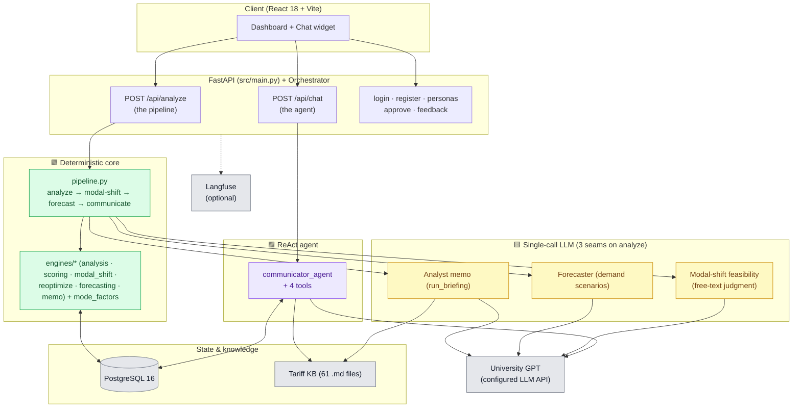

**Tech stack (as implemented):** Python 3.12 · FastAPI + Uvicorn · psycopg2 → Postgres 16
· LangChain / `langchain-openai` for LLM access · LangGraph `create_react_agent` (chat
only) · Langfuse (optional tracing/prompts/scores). No Redis, no vector DB, no Prophet/
scikit-learn — those older-plan components were never built.

---

## Chapter 2 — Inputs: what actually enters the system

The user-facing input is deliberately tiny. Every serving endpoint keys off a
**`user_id`** (plus, for chat, the message list). From that id, everything else is
**pulled from Postgres** — the "travel history sandbox" is seeded DB data, not a live API.

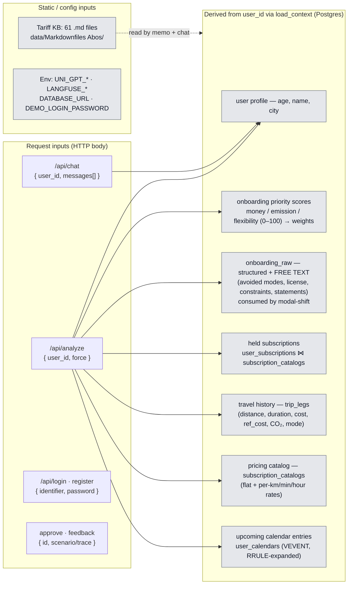

**Full endpoint surface** (`src/main.py`):

| Method & path | Kind | Purpose |
|---|:---:|---|
| `POST /api/analyze` | 🟩 pipeline + 🟨 memo/forecast/modal-shift | Run the full recommendation pipeline for a user |
| `POST /api/chat` · `/api/chat/stream` | 🟪 agent | Conversational advisor (ReAct agent over the LLM) |
| `POST /api/login` · `/api/register` | 🟩 | Shared-password / hashed-password auth against seeded users |
| `GET /api/personas` | 🟩 | List seeded users + prefs + subs |
| `POST /api/recommendations/{id}/approve` | 🟩 | Persist approval + Langfuse acceptance score |
| `POST /api/feedback` | 🟩 | Chat thumbs → Langfuse score |
| `GET /api/analyst/{id}` · `/api/forecaster/{id}` · `POST /api/forecaster/test` | 🟩/🟨 | Debug/introspection entry points for single stages |

The one canonical loader is [`agent/context.py::load_context`](../backend/src/agent/context.py) —
a **deterministic** DB read that also RRULE-expands recurring calendar events in Python.
It returns the seven derived blocks above (the free-text `onboarding_raw` was added for the
modal-shift engine) and is reused everywhere (pipeline, chat, baseline) so there is a single
source of truth for "what a user's data is."

---

## Chapter 3 — The `/api/analyze` pipeline (end-to-end)

This is the backbone. It is plain sequential Python in
[`agent/pipeline.py`](../backend/src/agent/pipeline.py); the
[`Orchestrator`](../backend/src/orchestrator.py) wraps it with caching, persistence and
response shaping. Colours mark the kind of each step.

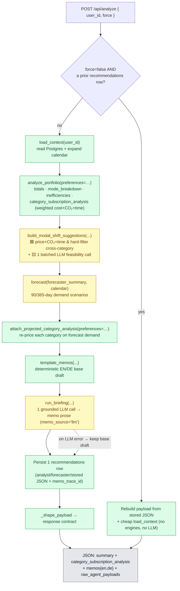

Key properties, straight from the code:

- **Numbers first, prose last.** `load_context`, `analyze_portfolio`, the deterministic
  cost/CO₂/time pricing inside modal-shift, `attach_projected_category_analysis` and the
  `template_memos` base draft produce every figure. **Three** LLM steps sit on top:
  `forecast` predicts trip counts, modal-shift makes one batched call judging *free-text*
  feasibility (feasible/not + reason, never a number), and `run_briefing` *rewrites* the
  memo prose over already-computed numbers. None computes money. (A deterministic safety
  net catches any runtime LLM error — forecaster → seasonal extrapolation, modal-shift →
  "feasible, low-confidence" fallback, memo → template draft.)
- **Weighted, preference-driven ranking.** Every keep/switch/cancel verdict is now the
  winner of a `cost + CO₂ + time` score weighted by the user's onboarding priorities
  (`engines/scoring.py`), not a pure-cost pick — see Chapter 4.
- **Synchronous.** A fresh run waits for the LLM forecast + memo so the response is
  final — no follow-up poll.
- **Read-through cache = the latest `recommendations` row.** There is no Redis; an
  unforced call replays stored JSON.

---

## Chapter 4 — The Analyst / number engine (🟩 deterministic)

[`engines/analysis.py`](../backend/src/agent/engines/analysis.py) (~1,480 lines) is the
authoritative compute. It ingests leg-level history + held subs + the priced catalog +
the onboarding **preferences**, and emits usage stats, inefficiencies, and — the headline —
**`category_subscription_analysis`**: per travel category, a comparison of *current setup
vs. pay-as-you-go vs. eligible catalog alternatives*, each priced on **cost, CO₂ and time**,
with the winner chosen by a **preference-weighted score** (`engines/scoring.py`). **This is
"the optimizer"** — there is no separate optimizer agent; the old scenario generator was
deleted and folded in here.

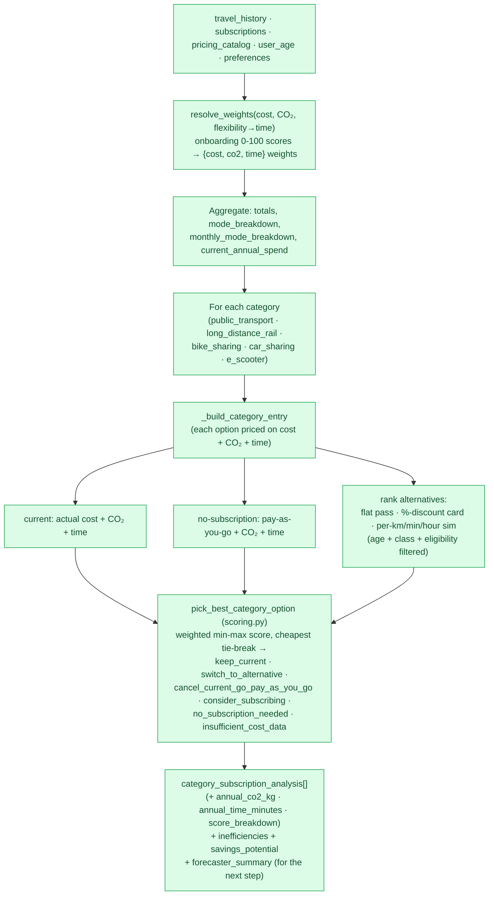

Design details worth knowing:

- **Weighted multi-criteria, still no LLM.** The verdict is the highest-scoring option on a
  per-decision min-max normalization of cost / CO₂ / time, weighted by the onboarding
  priorities (`resolve_weights`: money→cost, emission→co2, flexibility→time). **Within** a
  category the same physical trips happen regardless of which plan pays, so CO₂/time barely
  vary and the score reduces to **pure cost** (with an exact cheapest-cost tie-break) —
  reproducing the old behaviour. CO₂/time genuinely bite in the cross-category modal-shift
  engine (Chapter 4B). This closes the old "preferences collected but never consumed" gap.
- **No magic thresholds.** An inefficiency is flagged only when the math is unambiguous
  (a subscription cost more than it saved).
- **BahnCard vs. Deutschlandticket are split** into `long_distance_rail` vs.
  `public_transport` and treated as independent complements — a percentage-discount card
  is never presented as a replacement for a flat regional pass.
- **Eligibility guards:** age-band parsing (`Ages 27-64`), class matching (1./2. Klasse),
  and outright exclusion of plans whose eligibility can't be verified (disability/pension,
  employer/student benefit).
- **Pricing basis** distinguishes true flat-rate passes, recognized %-discount cards, and
  metered plans priced from `per_km/per_minute/per_hour/daily_cap` fields.

The shared vocabulary of the six `recommendation` verbs is what makes the engine directly
comparable to the LLM baseline in Chapter 11.

---

## Chapter 4B — Cross-category modal shift (🟩 pricing + 🟨 feasibility)

New in the `add_co2_and_flexibility` change:
[`engines/modal_shift.py`](../backend/src/agent/engines/modal_shift.py). Chapter 4 asks
"*within* this category, which plan is best?" — this asks the different question "would it
be worth shifting these trips to a **different** transport category entirely?" (e.g.
car-sharing trips onto public transport). It is the first place the pipeline compares
*across* categories, and the first place CO₂/time and the free-text onboarding actually
change an answer.

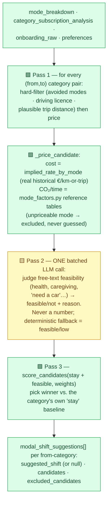

What makes it a clean example of the number-guard boundary:

- **Money, CO₂ and time stay deterministic.** Cost reuses the *same* real historical rate
  (`analysis.implied_rate_by_mode`, now a public function) — no second invented pricing
  formula; a mode the user has never used has no rate and its candidate is dropped, not
  guessed. CO₂/time come from [`mode_factors.py`](../backend/src/agent/mode_factors.py)'s
  reference tables (kept in sync with the seed generator by a drift-guard test), used only
  to price a *hypothetical* trip the user never actually took.
- **The LLM's only job is feasibility.** A single batched call reads the user's own
  free-text onboarding (`mobility_constraints` / `travel_statement` / `activity_statement`)
  and returns feasible/not + a reason per candidate — the real-world constraints no fixed
  rule can catch. It never overrides the deterministic hard-filter and never touches a
  figure. No key / parse error → every candidate defaults to feasible (low confidence).
- **Shared scorer.** The stay-vs-shift winner uses the same `engines/scoring.py` weighted
  score as Chapter 4, so within-category and cross-category recommendations rank on one
  consistent cost+CO₂+time scale. The memo (Chapter 6) and chat surface `suggested_shift`
  only when something actually beats staying.

---

## Chapter 5 — The Forecaster (🟨 single-call LLM)

[`engines/forecasting.py`](../backend/src/agent/engines/forecasting.py) is the **only
engine permitted to call the LLM**, and even then only to predict **demand (trip counts)**
— never money. It consumes the Analyst's `forecaster_summary` plus RRULE-expanded calendar
entries and produces one or more demand scenarios over a 90/365-day horizon.

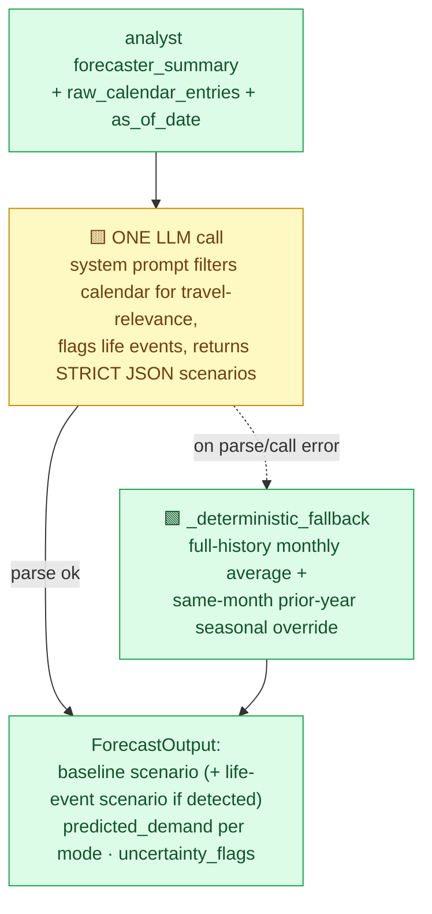

Why it is **not** an agent: the LLM makes a single completion over a JSON payload and
returns JSON. It has **no tools** and cannot loop. The calendar "reasoning" (deciding a
"Munich trip" implies long-distance rail, or that an "Umzug" is a relocation life event)
happens inside that one prompt. If the call errors or the JSON won't parse, the pure-Python
seasonal extrapolation runs instead, so the step always yields a forecast. The
forecast's *demand* is then handed back to the **deterministic**
`attach_projected_category_analysis`, which re-prices each category on the projected trips
(now preference-weighted, like Chapter 4) — money never touches the LLM. The JSON-extraction
helper is now the shared [`agent/json_extract.py`](../backend/src/agent/json_extract.py),
deduplicated across the forecaster, memo and modal-shift.

---

## Chapter 6 — The memo: Analyst briefing (🟨 single-call LLM + deterministic RAG)

The customer-facing memo is written by
[`analyst_agent.py::run_briefing`](../backend/src/agent/analyst_agent.py). The filename
says "agent," but it is **not** a ReAct loop — it is **one grounded LLM call** (plus at
most one re-prompt if it mixes languages). Crucially, the RAG retrieval is done
**deterministically by Python before the call**, then injected — the LLM does not choose
what to fetch.

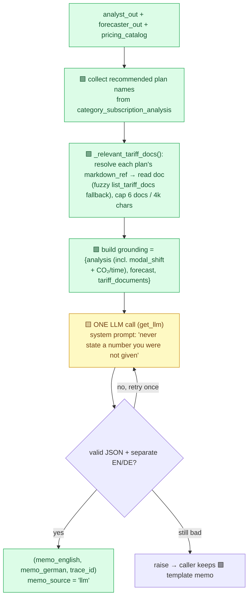

This is a **RAG-augmented single-call LLM**, distinct from the agentic RAG in the chat
(Chapter 7). Both read the same knowledge base, but here retrieval is a fixed Python step
(pre-fetch by `markdown_ref`), whereas in chat the model itself navigates the corpus. The
deterministic template alternative lives in
[`engines/memo.py::template_memos`](../backend/src/agent/engines/memo.py) and is always
built first as the guaranteed fallback. Both the template and the LLM memo now render a
cross-category **modal-shift section** with CO₂/time deltas (only when a `suggested_shift`
was found) and cite the **weighted-score winner** — which need not be the cheapest plan.

---

## Chapter 7 — The Chat Communicator (🟪 the one true ReAct agent)

[`communicator_agent.py`](../backend/src/agent/communicator_agent.py) powers `/api/chat`
and `/api/chat/stream`. It is built with LangGraph's `create_react_agent` and is the
**only** component where the LLM autonomously decides, in a loop (recursion limit 12),
which tools to call. It is grounded in the caller's context + latest recommendation and
can read the live catalog, navigate the tariff KB (agentic RAG), and re-optimise the
portfolio.

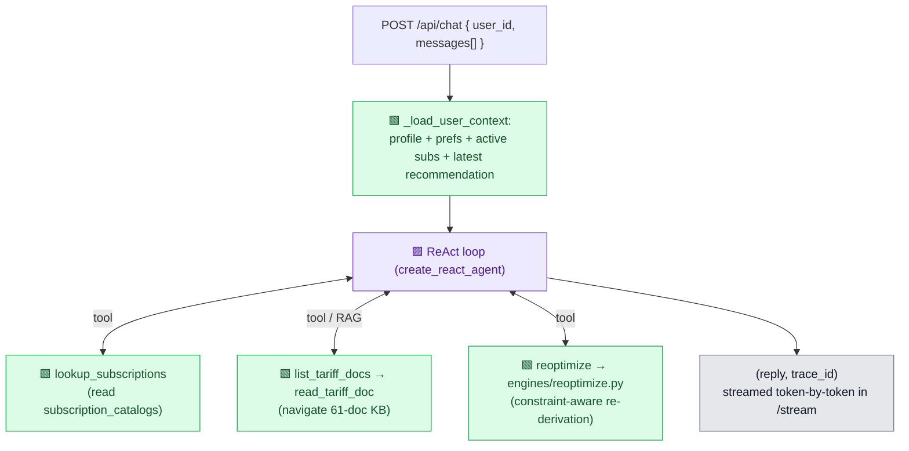

The chat's four tools are themselves **deterministic** — the agent is an LLM *reasoning
layer* over deterministic capabilities:

| Tool | File | What it does |
|---|---|---|
| `lookup_subscriptions` | [`tools/catalog.py`](../backend/src/agent/tools/catalog.py) | Read the live pricing catalog (cached) |
| `list_tariff_docs` / `read_tariff_doc` | [`tools/knowledge.py`](../backend/src/agent/tools/knowledge.py) | Agentic RAG over the tariff/AGB corpus |
| `reoptimize` | [`tools/optimize.py`](../backend/src/agent/tools/optimize.py) → [`engines/reoptimize.py`](../backend/src/agent/engines/reoptimize.py) | Re-derive the keep/switch/drop verdict under user constraints (weighted, like Chapter 4); optionally persist |

**The chat → optimizer feedback loop.** When the user says "keep my car" / "drop the
BahnCard" / "what if I switch to the Deutschlandticket," the LLM parses the wish into
`keep`/`drop`/`prefer_plans`/`exclude_plans` and calls `reoptimize`. That tool re-runs the
**deterministic** weighted cost+CO₂+time comparison (`scoring.pick_best_category_option`)
over the already-priced alternatives — numbers stay engine-grounded, and the **same
preference weights** as the original analysis are re-derived from the persisted
`analyst_out["preferences"]`, so a constraint-free re-optimisation reproduces what a fresh
`/api/analyze` would recommend. A **code-level gate** (`confirmed_turn`) forbids `apply=True`
on the first message, so a change is only ever persisted (as a new `recommendations` row)
after explicit confirmation — independent of what the model requests.

---

## Chapter 8 — The tariff knowledge base & RAG (🟩 retrieval, no embeddings)

[`tools/knowledge.py`](../backend/src/agent/tools/knowledge.py) exposes the 61 tariff/AGB
markdown files under `data/Markdownfiles Abos/`. Retrieval is by **navigation, not
vectors** — there is no Weaviate, no embeddings, no similarity search. The file tree is the
index; `build_index()` regenerates a human-readable `index.md`, but the tools scan the tree
directly so they work even if it's stale.

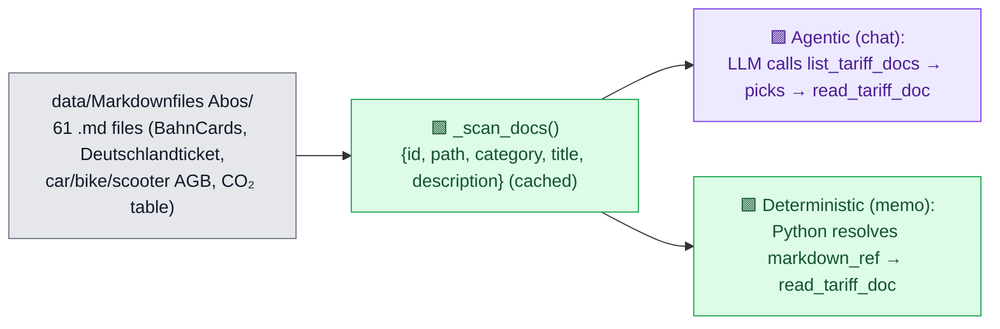

The same corpus is reached two ways: the chat agent **navigates** it (model-driven,
Chapter 7), while the memo **pre-fetches** the exact docs for the recommended plans
(Python-driven, Chapter 6). This is the concrete boundary between *agentic RAG* and
*deterministic retrieval-augmentation*.

---

## Chapter 9 — Orchestration, persistence & the data model (🟩)

[`orchestrator.py`](../backend/src/orchestrator.py) is the session/persistence layer that
separates the "agentic engine inside" from the "stable contract API outside." It owns the
read-through cache, writes each run to `recommendations`, shapes the exact frontend payload
(shared by fresh-run and cache paths so they can't drift), and records approvals — best-effort
mirrored to Langfuse.

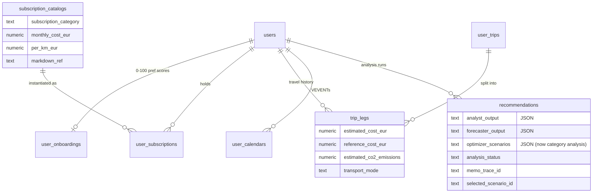

Notes: cost/CO₂/mode live at **`trip_legs`** (a trip's segments), not on the trip.
`recommendations.optimizer_scenarios` keeps its legacy column name to avoid a migration but
now stores the per-category analysis payload. `memo_trace_id` links a run to its Langfuse
memo generation, so an **approval** (`/approve`) can attach a `recommendation-accepted`
score to the exact prose the user accepted. There is no separate audit table — the
`recommendations` lifecycle plus Langfuse traces are the audit trail.

---

## Chapter 10 — Cross-cutting: LLM access & observability

Two thin, single-responsibility modules isolate the external dependencies.
`agent/llm.py` owns the **configured** University GPT client — an API key is present, so
every LLM feature (forecast, memo, chat, baseline) is live. `agent/observability.py`
wraps Langfuse as a **purely additive** layer: absent Langfuse keys make every
trace/prompt/score a no-op, leaving the core flow untouched.

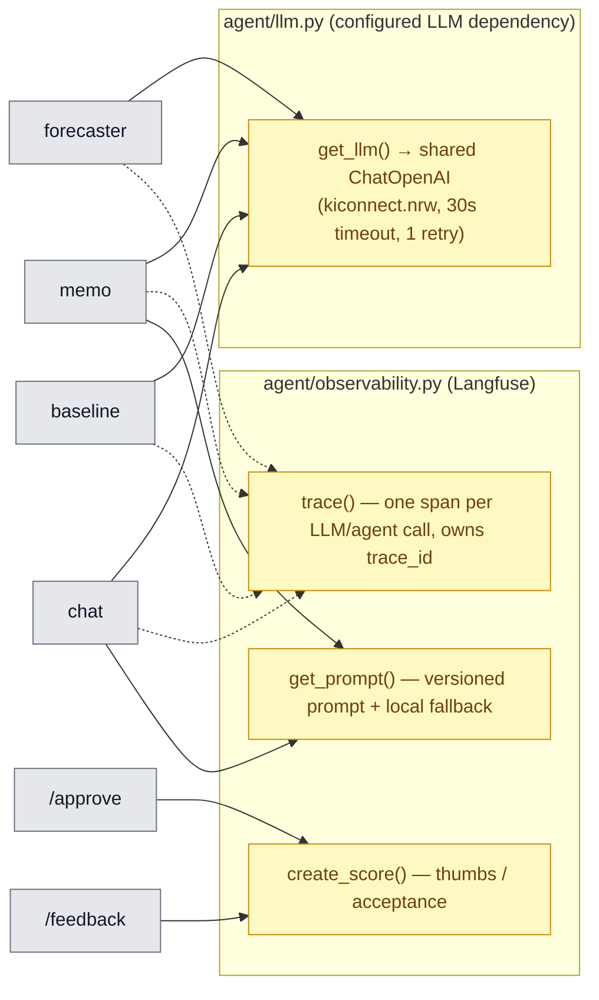

Resilience with the LLM present: a runtime LLM **error** (timeout / malformed output)
still degrades safely — the memo falls back to its template draft, the forecaster to
seasonal extrapolation, and a failed chat turn surfaces as a 500 / SSE-error the frontend
handles. Langfuse is the only true optional: absent Langfuse keys make every
trace/prompt/score a no-op.

---

## Chapter 11 — The evaluation harness (off the serving path)

A parallel, **non-serving** track quantifies how close a bare LLM gets to the deterministic
pipeline. [`baseline_pipeline.py`](../backend/src/agent/baseline_pipeline.py) is a **🟨
single LLM call** over the *raw* context (no engines, no forecaster, no number guard),
emitting the same six-verb recommendation vocabulary as the engine — so both are scored on
one rubric with the deterministic engine as ground truth.

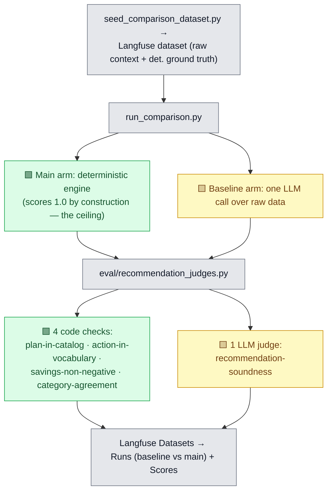

This harness is **not wired to any endpoint or the frontend** — it is run manually from
`backend/` (`run_baseline.py`, `run_comparison.py`, `run_experiment.py`). Its whole purpose
is to justify the number-guard architecture: it measures the gap between "let the LLM
decide" and "let deterministic engines decide, LLM only narrates."

---

## Chapter 12 — Component taxonomy (the definitive classification)

The one-glance answer to "which parts are agents vs. LLM calls vs. deterministic scripts."

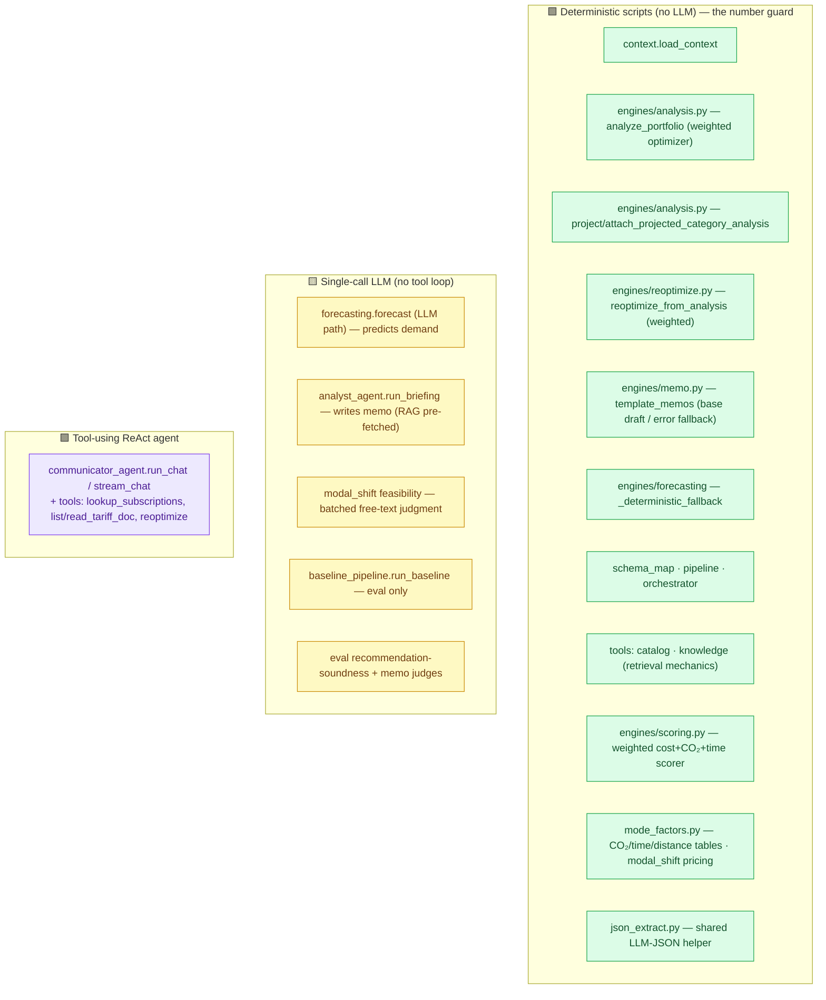

| Component | Kind | Tools? | RAG? | LLM calls | On-error fallback |
|---|:---:|:---:|:---:|:---:|---|
| `load_context` | 🟩 DET | — | — | 0 | — |
| `analyze_portfolio` (weighted optimizer) | 🟩 DET | — | — | 0 | — |
| `attach_projected_category_analysis` | 🟩 DET | — | — | 0 | — |
| `reoptimize_from_analysis` | 🟩 DET | — | — | 0 | — |
| `scoring` · `mode_factors` · `template_memos` | 🟩 DET | — | — | 0 | — |
| modal-shift pricing (cost/CO₂/time + filter) | 🟩 DET | — | — | 0 | — |
| Forecaster | 🟨 LLM | no | no | 1 | 🟩 seasonal |
| Modal-shift feasibility | 🟨 LLM | no | no | 1 (batched) | 🟩 feasible/low |
| Analyst memo (`run_briefing`) | 🟨 LLM | no (pre-fetch) | 🟩 deterministic | 1 (+1 retry) | 🟩 template draft |
| Baseline (eval) | 🟨 LLM | no | no | 1 | none (eval) |
| **Chat Communicator** | 🟪 **AGENT** | **yes (4)** | 🟪 **agentic** | loop (≤12) | error → frontend |

**Bottom line.** The architecture is a deterministic, preference-weighted engine with
**three** narrow LLM seams on the analyze path (forecast demand; judge modal-shift
feasibility; write the memo) — all live on every run — and exactly one interactive agent
(chat). The "agent" vocabulary in filenames/docs is conceptual; topologically it is
*deterministic pipeline steps (analyze → modal-shift pricing → forecast projection →
template memo) + 3 single-call LLM seams + 1 ReAct chat agent*. Every euro, **gram of CO₂
and minute of travel time** is deterministic and reproducible and now actively drives the
weighted recommendation; the LLM is confined to prose, demand and free-text feasibility,
with a deterministic safety net on runtime error.
