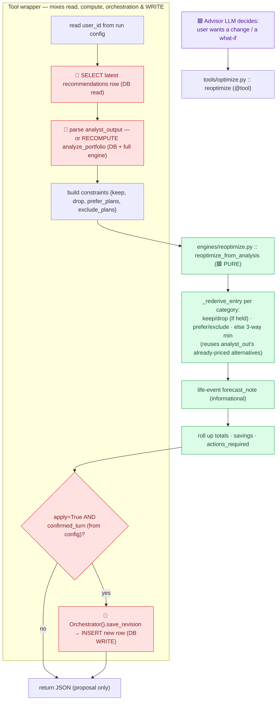
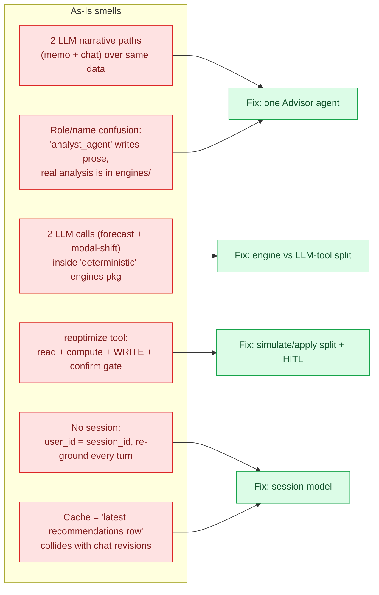
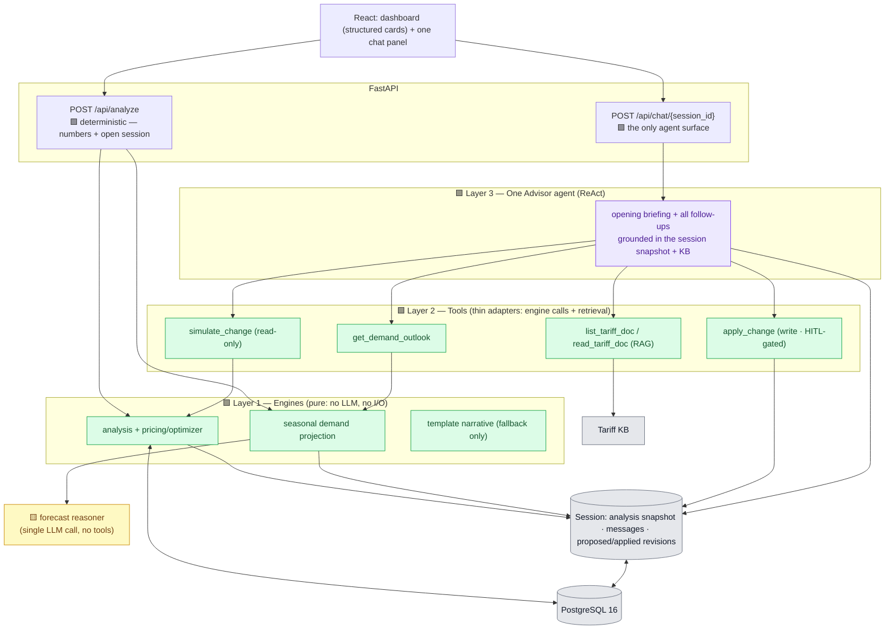
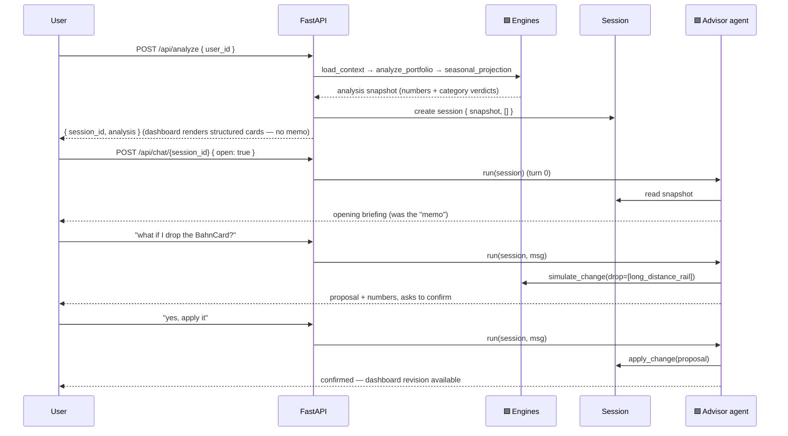
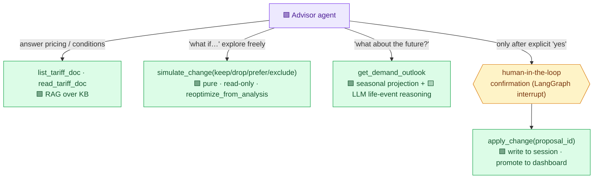
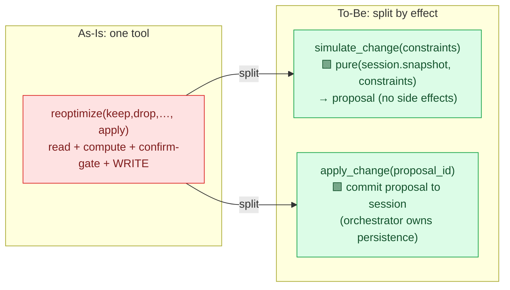
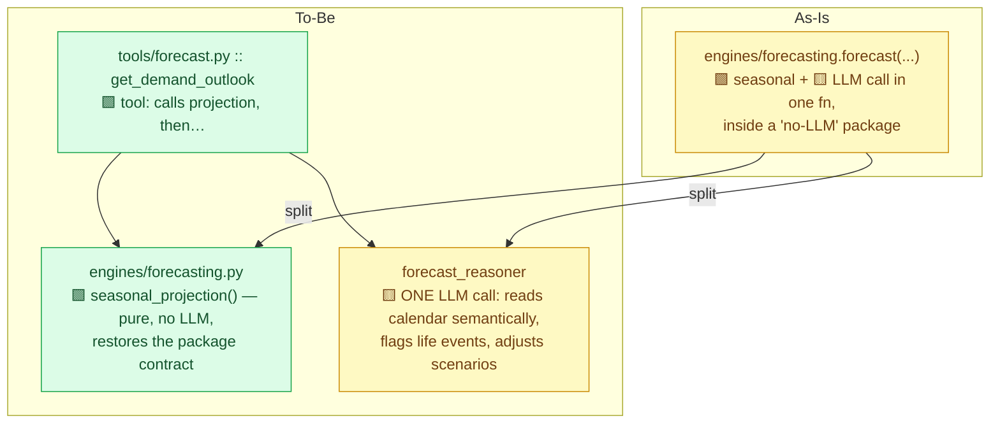
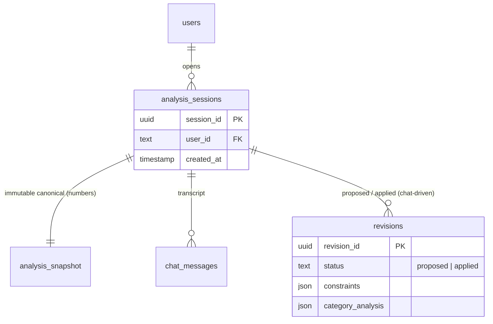
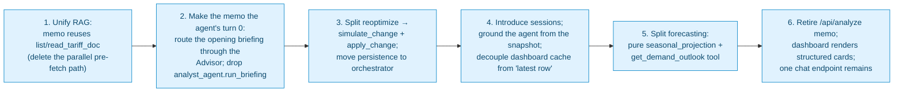
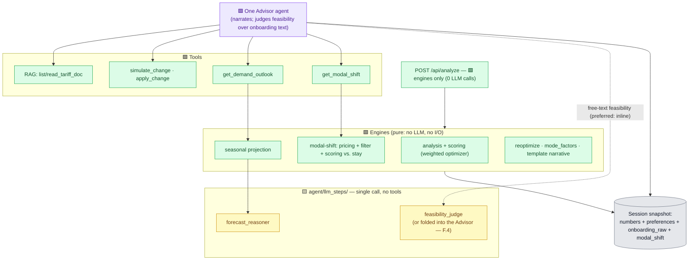

# DB MoveOptimizer — Backend Review & To-Be Architecture

Companion to [BACKEND_ARCHITECTURE_REPORT.md](BACKEND_ARCHITECTURE_REPORT.md) (the As-Is).
This document (1) answers the four review notes, (2) consolidates the As-Is problems, and
(3) proposes a To-Be architecture that keeps the number-guard but cleanly separates
**engines / tools / agents**, collapses the two chat surfaces into one, and gives the user
real freedom to ask questions and change their mind.

Legend (same as the As-Is report): 🟩 **DET** deterministic · 🟨 **LLM** single call (no
tools) · 🟪 **AGENT** ReAct tool loop.

> **Parts A–E were written against commit `f02d7c4`.** The `add_co2_and_flexibility` pull
> (HEAD `f41b2a5`) added weighted CO₂/time scoring and a cross-category modal-shift engine.
> **Part F** (at the end) reconciles the plan with those changes: what still holds, what's
> reinforced, and the one genuinely new work item. Read Parts A–E for the reasoning; read
> Part F for the current marching orders.

---

## Part A — The four review notes, answered

### A.1 "Two chat features (memo + chat) → condense into one endpoint" ✅ agreed

There are today **two independent LLM narrative paths** over the *same* grounding:

| | Memo | Chat |
|---|---|---|
| Code | `analyst_agent.run_briefing` | `communicator_agent.run_chat` |
| Kind | 🟨 single grounded call | 🟪 ReAct agent |
| Prompt | `prompts/analyst_system.md` | `prompts/communicator_system.md` |
| Grounding | Python pre-fetches tariff docs by `markdown_ref` | LLM navigates KB via tools |
| Trigger | synchronous on `/api/analyze` | `/api/chat` per turn |

The frontend already treats the memo **as the chat's first turn** — it injects the
analyze-produced memo as the opening assistant message
([`useChat.js:107-115`](../frontend/src/components/chat/useChat.js)) *and* renders it again
as a static "full analysis" panel ([`PortfolioDetail.jsx:260-263`](../frontend/src/pages/PortfolioDetail.jsx)).
So the split is already fictional at the UI layer. The redundancy costs: two prompts to
keep consistent, two grounding assemblers, duplicated tariff retrieval, and a memo that is
**frozen at analyze-time** while the chat re-derives everything each turn (they can drift).

**Verdict:** collapse to one conversational **Advisor agent**. The "memo" becomes its
**opening turn**, produced by the same agent, prompt, tools and grounding as every
follow-up. See Part C.

### A.2 "The single endpoint should be the ReAct agent, given the deterministic output + KB, reacting to the user" ✅ this is the To-Be

Exactly the design in Part C: `/api/analyze` stays **purely deterministic** (it computes
the numbers and opens a session); the **Advisor agent** is the sole narrative surface,
grounded in that deterministic analysis snapshot + the tariff KB, and it both delivers the
opening briefing and answers every follow-up in the same loop.

### A.3 `reoptimize()` — what it actually does, in detail

`reoptimize` is two layers. The **pure engine** is good; the **tool wrapper** is doing far
too much.

**What's good (keep):** `reoptimize_from_analysis` is a pure function that re-derives the
per-category verdict under constraints by reusing the *already-priced* `alternatives` from
`analyst_out` — so numbers stay engine-grounded and a re-optimisation is consistent with a
fresh analysis. That's the number-guard working correctly.

**What's wrong (fix):**

1. **One tool does read + compute + orchestrate + WRITE.** `apply=True` inserts a new
   `recommendations` row from *inside a tool call*. A tool that mutates persistent state as
   a side-effect is the classic agent-safety footgun.
2. **The confirmation rule lives in three places** — the system prompt ("only apply after
   explicit confirmation"), a `confirmed_turn` code gate injected through the run config,
   and the tool's own `note`. Scattered, hard to reason about, easy to regress.
3. **DB access + a possible full `analyze_portfolio` recompute inside the tool.** Heavy I/O
   and orchestration buried where it can't be seen or tested cleanly.
4. **Layering violation:** the tool imports `Orchestrator` (tools → orchestrator → pipeline
   → agent → tools is a dependency cycle).
5. **Implicit "latest row wins" coupling:** an applied chat revision writes the newest
   `recommendations` row, which the `/api/analyze` read-through cache then serves as the
   dashboard's canonical analysis — a surprising, undocumented coupling.

**Fix (Part C.4):** split into `simulate_change` (🟩 pure, read-only, always safe) and
`apply_change` (explicit write via a human-in-the-loop confirmation step), both operating on
the **session** snapshot rather than re-reading "the latest row."

### A.4 "Is it clean code for `forecast()` to make an LLM call inside the method?" — No.

Concretely:

- **It breaks its own package's contract.** `agent/engines/__init__.py` states: *"Deterministic
  engines — pure functions, no LLM, no I/O. Source of truth for numbers."* Yet
  `forecasting.forecast` — exported from that package — makes a network LLM call.
- **Two responsibilities in one ~530-line module/function:** pure seasonal projection
  (`_deterministic_fallback`, `_mode_full_average`, `_same_months_prior_year_average`) *and*
  LLM prompt-building / calling / parsing / retry.
- **Flag-argument smell:** `forecast(analyst_summary, calendar_events, ics_text,
  raw_calendar_entries, forecast_horizon_days, as_of_date, use_llm)` — a 7-param function
  whose `use_llm` boolean flips the entire behaviour.
- **Lazy in-function imports of `agent.llm`** to keep up the "engine" pretence.
- **Tests must monkeypatch `agent.llm.llm_available`** to force determinism — a tell that
  the two concerns aren't separated.

**Fix (Part C.5):** keep `engines/forecasting.py` as a **truly pure** seasonal projection
(the current "fallback" *is* the deterministic baseline — promote it), and move the semantic
LLM demand-reasoning out of the engines package into a single-purpose **LLM step exposed as
a tool** (`get_demand_outlook`) the Advisor calls on demand.

> **Update after the `add_co2_and_flexibility` pull:** this is no longer a one-off.
> `engines/modal_shift.py` now makes a **second** LLM call inside the engines package (its
> docstring even says it "mirrors forecasting.py's pattern"). The anti-pattern has become a
> repeated *pattern* — see **Part F**, which generalises this fix.

---

## Part B — As-Is problems, consolidated

Everything below preserves the one thing the As-Is gets right: **every number comes from a
deterministic engine; the LLM only narrates and parses intent.**

---

## Part C — To-Be architecture

### C.1 Three clean layers, exactly one agent

The rule that makes the taxonomy honest: **an "agent" is a thing that runs a tool loop.
Everything else is an engine (pure math) or a tool (a thin adapter that exposes an engine or
a retrieval to the agent).** By that rule the system has exactly **one** agent, a handful of
tools, and pure engines underneath — no `*_agent.py` file that is secretly a single call.

### C.2 Request flow — deterministic analyze, conversational everything-else

Key shifts vs. As-Is:

- `/api/analyze` no longer calls any LLM. It returns numbers and opens a session; the
  dashboard renders the **structured** `category_subscription_analysis` (cards it already
  has) instead of a prose memo.
- The **opening briefing** is the agent's turn 0 — same agent/prompt/tools as follow-ups.
- The forecaster LLM call is **no longer on the synchronous analyze path**; the deterministic
  seasonal projection ships with the analysis, and the richer LLM outlook is fetched **only
  when the conversation needs it** (`get_demand_outlook`).

### C.3 The Advisor tool belt — and the read/write split

This is what gives the user **flexibility to ask and to change their mind safely**:

- **`simulate_change`** is pure and read-only — the user can explore any number of
  "what ifs" ("keep the car", "drop the BahnCard", "prefer the Deutschlandticket") with zero
  risk; each returns engine-computed numbers.
- **`apply_change`** is the *only* state-mutating tool and is reachable only through an
  explicit confirmation step. The confirmation is enforced **in one place** (a
  human-in-the-loop interrupt / an explicit `/apply` call), not scattered across a prompt +
  a config flag + a tool note.

### C.4 `reoptimize` → `simulate_change` + `apply_change`

- Both call the **unchanged** pure `reoptimize_from_analysis` against the **session's**
  analysis snapshot — no DB reads, no `analyze_portfolio` recompute, no `Orchestrator` import
  inside a tool.
- `apply_change` records the chosen proposal onto the session's *current recommendation*,
  distinct from the immutable canonical analysis — killing the "latest row silently becomes
  the dashboard" coupling. Promotion to the dashboard is an explicit, visible step.

### C.5 Forecasting — engine vs. LLM-tool, cleanly separated

Result: the `engines` package is once again *pure* (its docstring becomes true), the LLM
demand-reasoning is a single honest step, and the forecast runs **on demand** in
conversation rather than as a mandatory synchronous LLM call on every analyze.

### C.6 Session & state model

A session cleanly separates three things the As-Is conflates in one `recommendations` row:
the **canonical analysis** (immutable, deterministic), the **conversation**, and
**chat-driven revisions** (proposed vs. applied). The agent grounds from the snapshot every
turn without re-querying, and revisions never silently overwrite the canonical numbers.

### C.7 Component taxonomy (To-Be)

| Component | Layer | Kind | Notes |
|---|---|:---:|---|
| `load_context`, `analyze_portfolio` (+optimizer) | Engine | 🟩 | Unchanged — the number source |
| `seasonal_projection` (was forecast fallback) | Engine | 🟩 | Now *pure*; ships with the analysis |
| `reoptimize_from_analysis` | Engine | 🟩 | Unchanged — reused by `simulate_change` |
| `template_narrative` | Engine | 🟩 | Fallback only (agent error) |
| `list/read_tariff_doc` | Tool | 🟩 | Single RAG surface (memo + chat share it) |
| `simulate_change` | Tool | 🟩 | Read-only what-if |
| `apply_change` | Tool | 🟩 | Only writer; HITL-gated |
| `get_demand_outlook` | Tool | 🟩→🟨 | Calls projection, then the reasoner |
| `forecast_reasoner` | LLM step | 🟨 | One call, no tools |
| **Advisor** | Agent | 🟪 | The only agent; opening briefing + chat |

---

## Part D — Migration path (incremental, each step shippable)

Steps 1–3 are pure backend refactors with no schema change and no UX regression (the
frontend already treats the memo as the first chat message). Steps 4–6 add the session
layer and the endpoint consolidation.

---

## Part E — As-Is → To-Be at a glance

| Concern | As-Is | To-Be |
|---|---|---|
| Narrative surfaces | Memo (🟨 call) **+** chat (🟪 agent) | **One** Advisor agent (opening briefing = turn 0) |
| Prompts | `analyst_system` + `communicator_system` | One advisor prompt |
| Tariff retrieval | Pre-fetch (memo) **+** navigation (chat) | One RAG tool surface |
| `reoptimize` | 1 tool: read+compute+confirm+**write** | `simulate_change` (read) + `apply_change` (write, HITL) |
| Forecast | 🟨 LLM call **inside** `engines/` | 🟩 pure projection + 🟨 `forecast_reasoner` tool |
| `/api/analyze` | Deterministic **+ synchronous LLM memo/forecast** | Deterministic **only**; opens a session |
| State | `recommendations` "latest row"; no session | Session: snapshot + messages + revisions |
| Change a decision | `apply=True` flag, gate in 3 places | Explicit confirm step; one enforcement point |
| "Agent" count (real tool loops) | 1 (but 3 `*_agent`-named files) | 1 (and the name means it) |
| Number guard | ✅ preserved | ✅ preserved & strengthened |

**Bottom line.** Keep the deterministic core exactly as it is — it's the system's biggest
strength. Change the *shape around it*: one agent instead of a memo-call plus a chat-agent,
tools that are honestly named and correctly split by side-effect (read vs. write), a
forecaster that stops pretending to be a pure engine, and a session model that lets the user
explore and revise freely without silently mutating the canonical analysis.

---

## Part F — Reconciliation after the `add_co2_and_flexibility` pull

The pull (`f02d7c4 → f41b2a5`) changed the As-Is under this plan. The **shape** of the To-Be
is unchanged — one agent, three clean layers, session model, read/write split. But two
recommendations are now *reinforced*, one is *already partly delivered*, and one **new work
item** appears. Net: the plan gets slightly bigger and its case gets stronger.

### F.1 What the pull changed, relative to this plan's assumptions

| Change | Effect on the To-Be |
|---|---|
| **`engines/scoring.py`** — one pure weighted `cost+CO₂+time` scorer, reused by within-category analysis, `reoptimize`, and modal-shift | ✅ **A To-Be win already banked.** This *is* the "one pure engine, reused everywhere" the engine layer (C.1) calls for. Keep it as the model for the layer. |
| **`engines/modal_shift.py`** — new cross-category engine: deterministic pricing/CO₂/time/filter/scoring **+ one batched LLM feasibility call inside the engine** | ⚠️ **New work.** A **second** LLM-call-in-an-engine (see F.3) and a **third** synchronous LLM seam on `/api/analyze` (see F.4). |
| **`mode_factors.py`, `json_extract.py`** — pure reference tables; shared JSON-extraction helper | ✅ Clean. `json_extract` dedups the three `_extract_json` copies — a small DRY win the plan implied. |
| **`onboarding_raw`** now loaded + consumed (free-text feasibility); `reoptimize` + memo now preference-weighted & modal-shift-aware | The session snapshot (C.6) must now carry `preferences`/weights + `onboarding_raw` + the deterministic `modal_shift` result; the tool wrapper does even more (F.2). |

### F.2 Section-by-section impact

| To-Be item | Status | Why |
|---|---|---|
| **A.1** merge memo + chat | **Reinforced** | The memo now also narrates modal-shift + CO₂/time deltas — *more* state frozen at analyze-time, so the frozen-vs-live drift is bigger and the merge more valuable. |
| **A.2** single agent surface | Holds | Unchanged. |
| **A.3 / C.4** split `reoptimize` | **Reinforced (worse)** | The tool wrapper now *also* re-derives weights from persisted `analyst_out["preferences"]` — more logic buried in the tool. The pure engine now takes `weights` (still pure). `simulate_change` must thread the snapshot's weights. |
| **A.4 / C.5** forecast LLM-in-engine | **Generalises → new work** | `modal_shift` is a 2nd instance; see F.3. |
| **C.1** three layers | **Reinforced + grows** | Engine layer gains `scoring` + `mode_factors` (clean). A **second** single-call LLM step (feasibility judge) joins the forecast reasoner. |
| **C.2** deterministic `/api/analyze` | **Changes** | Now **three** synchronous LLM calls to move off the critical path (forecast + feasibility + memo), not one. |
| **C.3** tool belt | **New tool** | Needs a modal-shift capability; the feasibility judgment can fold into the Advisor (F.4). |
| **C.6** session snapshot | Minor | Snapshot must include `preferences`/weights, `onboarding_raw`, and the deterministic `modal_shift_suggestions`. |
| **C.7** taxonomy | Update | Add `scoring`, `mode_factors`, the modal-shift engine, and the feasibility judge. |
| Number guard | ✅ Stronger | CO₂ and time are now deterministic *and consumed*, not baseline-only. |

### F.3 The one structural insight: the LLM-in-engine anti-pattern is now a *pattern*

`modal_shift.py`'s docstring literally says it "mirrors forecasting.py's structured-output
pattern (pydantic-validated JSON … deterministic fallback)." That is the tell: the codebase
now has a **reusable recipe** for "pure engine + one structured LLM call + deterministic
fallback, all in one module inside `engines/`." Left alone, it will be copied a third time.

So **C.5 upgrades** from "split forecasting" to "**extract the pattern once**": give
single-call structured-output LLM steps their own home (`agent/llm_steps/`, pure-in →
pure-out), leaving `engines/` genuinely LLM-free. One pattern, two current instances
(`forecast_reasoner`, `feasibility_judge`).

### F.4 The cleaner move for modal-shift feasibility — collapse it into the Advisor

The feasibility judge is *free-text reasoning over the user's own words* ("do they say they
need a car / have a health constraint?"). That is exactly what the ReAct Advisor is for. In
the To-Be, the **deterministic** modal-shift (pricing + scoring vs. stay) is a tool
(`get_modal_shift`); the **feasibility** judgment can simply be the agent's own reasoning
over the `onboarding_raw` already in the session snapshot — **no separate LLM seam at all**.

So the To-Be can *reduce* the LLM-seam count rather than relocate it:

| Seam | As-Is (post-pull) | To-Be |
|---|---|---|
| memo prose | synchronous LLM call | Advisor's **turn 0** |
| demand forecast | synchronous LLM call | `get_demand_outlook` (on-demand) |
| modal-shift feasibility | synchronous LLM call | **Advisor reasons inline** (or a lazy `feasibility_judge` step if you want a dashboard badge precomputed) |

Result: `/api/analyze` makes **0** LLM calls (down from 3); every LLM touch is either the
one agent or an on-demand step it triggers.

### F.5 Updated / added work items

The Part D path still holds; adjust two steps and add one:

- **Generalise old step 5** → *"Purify `engines/`: extract **both** the forecast and the
  feasibility LLM calls into `agent/llm_steps/`; `engines/` becomes LLM-free."*
- **New step (7): move modal-shift's LLM feasibility off the synchronous path** — preferred:
  fold it into the Advisor's reasoning (F.4); alternative: a lazy `feasibility_judge` step.
  Keep modal-shift's deterministic pricing/scoring in the analyze-time snapshot.
- **No work on `scoring.py`** — it already models the target engine layer; new tools
  (`simulate_change`, `get_modal_shift`) should reuse it, never re-implement scoring.
- **Snapshot (step 4) grows** to carry `preferences`/weights + `onboarding_raw` +
  `modal_shift_suggestions`, so the Advisor can narrate and re-simulate without re-querying.

### F.6 Verdict

Nothing in Parts A–E is invalidated. The pull **validates the direction** (a shared pure
scorer is exactly the engine-layer discipline this plan argues for) while **adding one clear
task**: the "LLM inside a deterministic engine" smell is now a repeated pattern across
`forecasting.py` and `modal_shift.py`, so extract it into a single `agent/llm_steps/` home —
and, for modal-shift specifically, prefer folding feasibility into the one Advisor agent so
`/api/analyze` returns to **zero** synchronous LLM calls.
