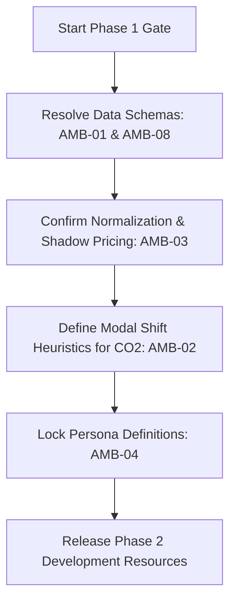

# Requirements Ambiguity Analysis
## DB MoveOptimizer — BCG Platinion Strategy IT Consulting Pilot

This document analyzes the functional, architectural, and mathematical requirements of the **DB MoveOptimizer** Phase 1 Pilot. While the strategic blueprint and user stories provide a solid foundation, several critical ambiguities and logical gaps have been identified that could block technical execution if not resolved prior to entering Phase 2 (Core Agent Development).

---

## 🔍 CRITICAL AMBIGUITY INDEX

We have categorized the ambiguities based on their impact on technical delivery, mathematical validity, and operational feasibility:

| ID | Title | Component | Impact | Category |
| :--- | :--- | :--- | :---: | :--- |
| **AMB-01** | **Regional vs. Long-Distance Train Distinction** | Optimizer / Sandbox API | 🔴 **Showstopper** | Data Model Gap |
| **AMB-02** | **CO₂ Footprint & Modal Shift Paradox** | Optimizer | 🔴 **Showstopper** | Mathematical Logic |
| **AMB-03** | **Multi-Scenario Normalization Formula** | Optimizer / Ranking | 🟡 **High** | Mathematical Formula |
| **AMB-04** | **"5 Core Traveler Personas" Specifications** | Analyst / Sandbox | 🟡 **High** | Test Configuration |
| **AMB-05** | **Sparse Travel History & Naive Forecasting Fallback** | Forecaster | 🟡 **High** | Algorithmic Boundary |
| **AMB-06** | **UI Technology Mismatch: Streamlit vs. React** | Communicator / UI | 🟢 **Medium** | Architectural Alignment |
| **AMB-07** | **Conversational Override State Machine** | Orchestrator / UI | 🟢 **Medium** | State Machine Logic |
| **AMB-08** | **Non-Train Travel Mode API Representation** | Sandbox API | 🟢 **Medium** | Schema Definition |
| **AMB-09** | **PostgreSQL vs. Redis Sync Flow** | Orchestrator / DB | 🟢 **Low** | Cache Topology |

---

## 🔴 BLOCKING AMBIGUITIES (MUST RESOLVE IMMEDIATELY)

### AMB-01: Regional vs. Long-Distance Train Distinction
> [!IMPORTANT]
> **The Problem:** The current simulated DB Navigator API schema (`ARCHITECTURE.md` line 298) and the `travel_history` database table (`ARCHITECTURE.md` line 235) represent all train trips under a single flat category: `mode: "train"`.
> 
> **Why this blocks implementation:** 
> Deutsche Bahn's pricing catalogs operate on two entirely separate tariff models:
> 1. **Deutschlandticket (€49/month):** Covers unlimited travel *strictly* on regional and local transit (RE, RB, S-Bahn, U-Bahn, buses). It **does not** cover long-distance trains.
> 2. **Bahncard 25/50/100:** Primarily targets discounts (25% or 50%) on long-distance trains (ICE, IC, EC) and selected regional routes.
>
> If the travel log only shows `mode: "train"`, `distance_km`, and `cost_eur` without specifying the **train type** (e.g., ICE vs. RE) or a boolean flag `is_regional`, **the Optimizer cannot mathematically evaluate whether a trip can be covered by a Deutschlandticket or discounted by a Bahncard.**
>
> **Proposed Resolution:** Update the sandbox JSON API schema and SQL table definition to include `train_type` (enum: `ICE`, `IC`, `RE`, `RB`, `S-Bahn`) or a boolean `is_regional` field:
> ```json
> {
>   "mode": "train",
>   "train_type": "ICE",
>   "is_regional": false
> }
> ```

---

### AMB-02: CO₂ Footprint & Modal Shift Paradox
> [!IMPORTANT]
> **The Problem:** Story 6 (`MVP_REQUIREMENTS.md` line 107) requires the Optimizer to calculate CO₂ savings for scenarios (Cost-Optimized vs. Balanced/Sustainability). However, under "Phase 2+ Backlog", it states: `❌ Live contract execution (no actual DB/partner API changes)` and the Forecaster agent strictly predicts trip counts *by mode* based on history.
>
> **Why this blocks implementation:**
> If the predicted travel demand (distances, trip counts, and modes) is **fixed** for a customer, changing their *subscription portfolio* (e.g., buying a Bahncard 50 instead of pay-as-you-go) will result in the **exact same CO₂ emissions**! 
>
> For the "Sustainability Focus" scenario to actually reduce CO₂ by 50% (as proposed in `PROJECT_PLAN.md` Decision 1.2), **the system must assume a modal shift** (e.g., if a customer is recommended a Deutschlandticket, they are assumed to shift 20% of their short-distance car/scooter trips to regional trains).
>
> **Proposed Resolution:** Define explicit **modal shift heuristics** in the Optimizer's rule engine. E.g.:
> - *Rule 1:* If Deutschlandticket is in the recommended portfolio, shift $X\%$ of car trips under $30\text{ km}$ to regional train trips.
> - *Rule 2:* If no modal shift is allowed in Phase 1, formally clarify that the CO₂ output is static-reporting only, and the "Sustainability Focus" ranking will be identical to "Cost Focus".

---

## 🟡 HIGH-PRIORITY AMBIGUITIES (RESOLVE BEFORE SPRINT 2)

### AMB-03: Multi-Scenario Normalization Formula
> [!TIP]
> **The Problem:** The project locks scenario weights (Decision 1.2):
> - *Cost Focus:* 100% Cost
> - *Balanced:* 60% Cost / 40% Flexibility & Convenience
> - *Sustainability:* 50% Cost / 50% CO₂ reduction
>
> **Why this blocks implementation:**
> Cost is in Euros (€), CO₂ is in kilograms/tons (kg/t), and "Flexibility" is a qualitative dimension. We lack a concrete mathematical formula to normalize and score these.
>
> **Proposed Resolution:** Implement a min-max scaling approach across the baseline and generated scenarios, or establish a **Carbon Shadow Price** (e.g., valuing CO₂ at €25 per metric ton) to internalize emissions directly into the cost metric:
> $$\text{Weighted Score} = W_{\text{cost}} \times \left( \frac{\text{Cost}_{\text{scenario}}}{\text{Cost}_{\text{baseline}}} \right) + W_{\text{co2}} \times \left( \frac{\text{CO2}_{\text{scenario}}}{\text{CO2}_{\text{baseline}}} \right) + W_{\text{flex}} \times \text{FlexibilityScore}$$
> We must explicitly define how `FlexibilityScore` is calculated (e.g., number of active subscription contracts, or a penalty for cancellation lock-ins).

---

### AMB-04: "5 Core Traveler Personas" Specifications
> [!TIP]
> **The Problem:** `MVP_REQUIREMENTS.md` Story 1 requires loading travel logs for "5 core traveler personas". However, these personas are never defined.
>
> **Why this blocks implementation:**
> Data scientists cannot implement the `Synthetic Profile Generator` (Gate 1) without knowing what behaviors these personas represent. For example:
> - *Persona 1:* Daily short-distance regional commuter (high regional train, 0 long-distance).
> - *Persona 2:* Weekly long-distance business traveler (high ICE, low regional).
> - *Persona 3:* Multimodal urbanite (e-scooters, car sharing, occasional regional train).
> - *Persona 4:* Seasonal holiday traveler (travel concentrated in summer/winter).
> - *Persona 5:* Low-frequency budget traveler (mostly bus/regional).
>
> **Proposed Resolution:** Lock down the precise mathematical distributions (average trips/month, modes, typical distance, home city) for each of the 5 personas to allow reproducible testing.

---

### AMB-05: Sparse Travel History & Naive Forecasting Fallback
> [!TIP]
> **The Problem:** Forecaster Agent uses statistical models (Prophet/ARIMA) to predict 6-month demand. However, many real users have sparse histories (e.g., 3 trips a year). Time-series models fail to converge or yield highly inaccurate bounds on sparse data.
>
> **Why this blocks implementation:**
> We need a deterministic boundary for when the statistical Forecaster drops out and the "Naive historical replication" fallback (Decision 1.4) takes over.
>
> **Proposed Resolution:** Establish a threshold in the Orchestrator:
> - If total trips in 12-month history $< 10$, bypass Prophet/ARIMA and execute a **Naive Replicator** (predicting the same trips for the next 6 months, scaled for seasonality).
> - Explicitly define "specific catalog constraints" that trigger LLM demand overrides (e.g., if a user states in chat: "I am starting a new job in Hamburg next month").

---

## 🟢 MEDIUM/LOW AMBIGUITIES (POLISH / ALIGNMENT)

### AMB-06: UI Technology Mismatch: Streamlit vs. React
- **The Contradiction:**
  - `ARCHITECTURE.md` (lines 174, 232) specifies "React chat widget in DB App" and "React in DB App" for Layer 1.
  - `CONTEXT_LOCK.md` and `PROJECT_PLAN.md` choose "Streamlit" as the UI for the Phase 1 Pilot.
- **Resolution:** Clarify that for the Phase 1 academic pilot, the UI is **100% standalone Streamlit**. The React references in `ARCHITECTURE.md` are placeholders representing the "Phase 2 Enterprise Scale" UI target.

### AMB-07: Conversational Override State Machine
- **The Problem:** If a user asks a follow-up question (e.g. *"What if I commute to Munich twice a month instead?"*), it is unclear if:
  1. The LLM simply answers based on static data.
  2. The Orchestrator intercepts the request, updates the travel constraints, and re-runs the Analyst -> Forecaster -> Optimizer loop.
- **Resolution:** For MVP, restrict conversational queries to the static recommendation context. If a constraint change is requested, trigger a explicit state transition `re-optimizing` that re-runs the Optimizer with the new verbal parameter injected as a structured constraint.

### AMB-08: Non-Train Travel Mode API Representation
- **The Problem:** In `travel_history` schema, we have modes like `scooter` and `car`. But scooters don't have "stations" (Berlin Hbf to Munich Hbf).
- **Resolution:** The sandbox API mock generator should output geographical coordinate strings or general regional zone names for short-distance sharing modes rather than city stations.

### AMB-09: PostgreSQL vs. Redis Sync Flow
- **The Problem:** Session states are kept in Redis. Relational states are in PostgreSQL.
- **Resolution:** Establish that the FastAPI Orchestrator writes user choices directly to PostgreSQL (strong consistency for audit trials), and invalidates corresponding Redis caches.

---

## 🚀 PROPOSED DECISION PACKAGE FOR JUNE 16 STEERING GATE

To resolve these ambiguities, the consulting team recommends locking the following specifications as part of the **Phase 1 Decision Package**:



By resolving these 9 key items, we can ensure the 5-person consulting data science team can execute development during Weeks 5-8 with zero architectural friction, achieving the <30s end-to-end P95 latency SLA and ±5% mathematical precision target.
