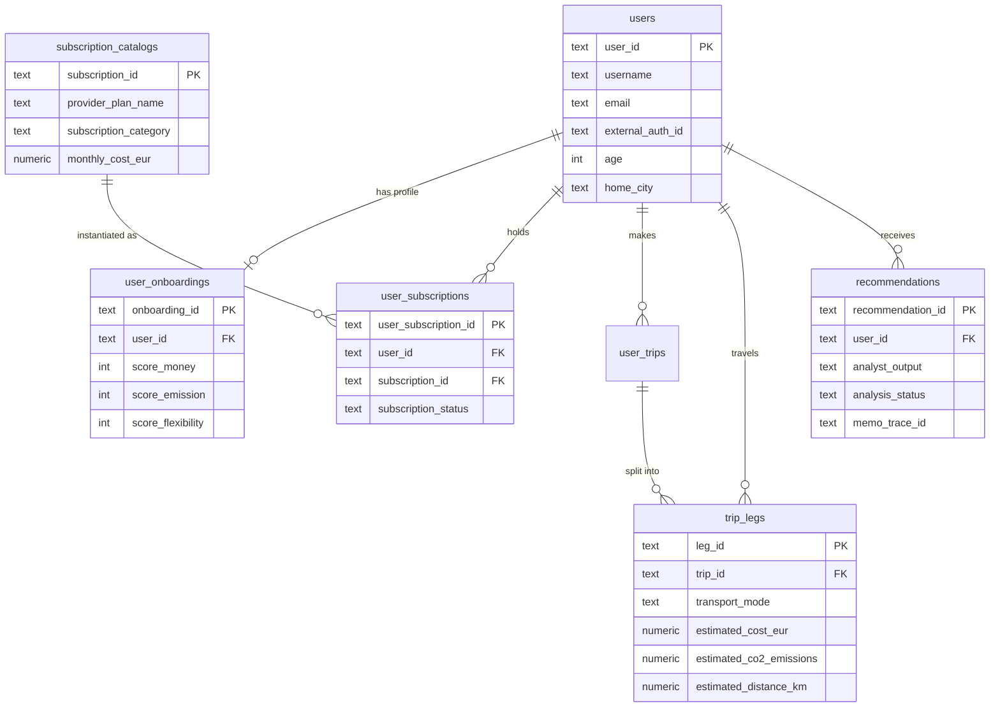
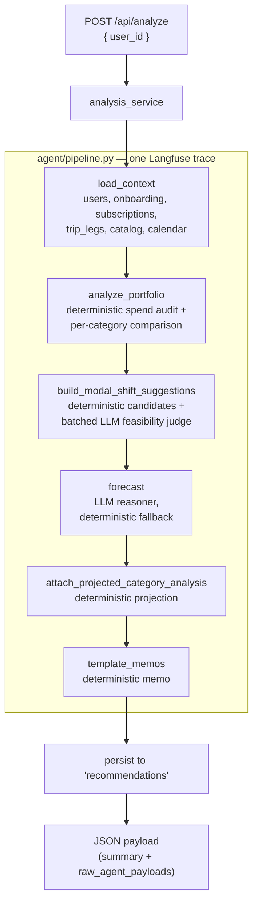
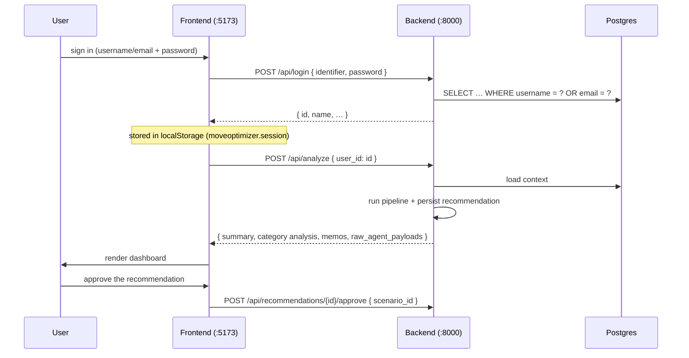
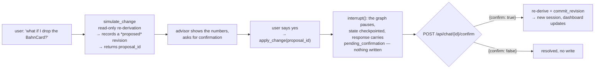

# Backend — FastAPI service and analysis pipeline

The backend is a **FastAPI** service that powers the mobility-subscription
advisor. It loads a customer's travel history from **PostgreSQL**, runs a
deterministic analysis pipeline with targeted LLM steps to audit spending,
forecast demand and compare subscription options, and returns a single JSON
payload that the React frontend renders as a dashboard. A conversational
advisor agent then explains and adjusts the result.

> [!NOTE]
> Setup, `.env` and Docker commands are in the [root README](../README.md).
> The UI is in [`frontend/README.md`](../frontend/README.md), the tariff corpus
> in [`data/README.md`](../data/README.md), and observability and evaluation in
> [`eval/README.md`](eval/README.md). This document covers the architecture, the
> data model, the pipeline, the API and the test suite.

---

## 1. Big picture


Four properties shape everything below:

- The frontend never talks to Postgres. It only calls the backend's `/api/*`
  endpoints, proxied by the Vite dev server, so the browser always makes
  same-origin requests.
- The backend owns all data access and all business logic.
- The **schema and seed data are provisioned by Postgres itself** from
  `database/init/*.sql`. The backend does not create tables; at startup it only
  confirms the database is reachable (`ping_db()`).
- **The LLM is optional and never authoritative.** Deterministic engines produce
  every number the dashboard shows. The LLM adds a forecast rationale, a
  feasibility judgement and the chat advisor's prose. Without a key the analysis
  still runs end to end on deterministic fallbacks; only the chat advisor
  returns `503`.

### Component taxonomy

Every backend component is exactly one of three kinds. This is the single most
useful framing for reasoning about the system:

| Kind | What it means | LLM calls | Components |
| --- | --- | :---: | --- |
| **Deterministic** | Pure Python engines, or thin adapters and stores. The authoritative source of every euro, gram of CO₂, minute and trip. | 0 | `context`, `analysis_service`, `session`, all of `engines/`, all of `tools/` |
| **Single-call LLM step** | Exactly one completion over a fixed payload, no tools. Predicts, judges or narrates — never a figure. Each has a deterministic fallback. | 1 | `llm_steps/forecast_reasoner`, `llm_steps/feasibility_judge`, `baseline_pipeline` (eval only) |
| **Agent** | One LLM that autonomously calls tools in a loop until it answers. There is exactly **one**. | loop | `advisor/agent.py` |

| Component | Kind | LLM calls | On-error fallback |
| --- | :---: | :---: | --- |
| `load_context`, `analyze_portfolio`, `scoring` | deterministic | 0 | — |
| modal-shift pricing, `seasonal_projection`, `reoptimize` | deterministic | 0 | — |
| session store, `analysis_service`, template memo | deterministic | 0 | — |
| `forecast_reasoner` | LLM step | 1 | deterministic seasonal projection |
| `feasibility_judge` | LLM step | 1 (batched) | deterministic feasible/low |
| `simulate_change` / `apply_change` | deterministic | 0 | `apply` pauses for confirmation |
| **Advisor** | **agent** | loop | template memo (turn 0), else `503` |

---

## 2. Tech stack

| Concern | Choice |
| --- | --- |
| Web framework | FastAPI + Uvicorn (`src/main.py`) |
| Analysis | Deterministic engines (`src/agent/engines/`) driven by `src/agent/pipeline.py` |
| Targeted LLM steps | `src/agent/llm_steps/` — forecast reasoner, feasibility judge |
| Chat advisor | ReAct agent with tools (`src/agent/advisor/agent.py`) |
| LLM access | LangChain + `langchain-openai` against University GPT (`src/agent/llm.py`) |
| Observability | Langfuse, optional (`src/agent/observability.py`) |
| Database driver | `psycopg2` (`src/database.py`) |
| Database | PostgreSQL 16 (Compose service `db`, database `app_db`) |
| Runtime | Python 3.12 (`backend/dockerfile`) |

Dependencies are in [`requirements.txt`](requirements.txt); test-only
dependencies in [`requirements-dev.txt`](requirements-dev.txt), which the
Dockerfile also installs into the image.

---

## 3. Directory layout

```text
backend/
├── dockerfile            # python:3.12-slim, runs `python src/main.py`
├── pytest.ini            # pythonpath = src ; testpaths = tests
├── tests/                # deterministic unit + smoke tests (no DB, no LLM) — see §9
├── scripts/              # one-off seed and experiment scripts — see eval/README.md
├── eval/                 # Langfuse judges + calibration harness — see eval/README.md
└── src/
    ├── main.py               # FastAPI app + HTTP endpoints
    ├── analysis_service.py   # /api/analyze lifecycle: cache, persist, shape the response
    ├── register_endpoint.py  # POST /api/register, POST /api/onboarding/{id}/complete
    ├── profile_endpoint.py   # GET + PUT /api/profile/{id}
    ├── auth_utils.py         # shared-password login helpers
    ├── database.py           # Postgres connection helper (get_connection / ping_db)
    └── agent/
        ├── pipeline.py           # the deterministic /analyze driver
        ├── baseline_pipeline.py  # single-LLM-call baseline, evaluation only — see eval/README.md
        ├── context.py            # load_context(user_id): the DB read behind every analysis
        ├── llm.py                # University GPT client + llm_available()
        ├── observability.py      # Langfuse tracing, managed prompts, scores
        ├── schema_map.py         # coverage rules, preference mapping, type coercion
        ├── mode_factors.py       # transport-mode cost/CO₂/time factors
        ├── session.py            # chat session state
        ├── json_extract.py       # tolerant JSON parsing of LLM output
        ├── engines/              # deterministic compute — the authoritative numbers
        │   ├── analysis.py           # audits travel history + subscriptions per category
        │   ├── forecasting.py        # demand forecast (LLM reasoner + deterministic fallback)
        │   ├── modal_shift.py        # cross-category mode-switch candidates
        │   ├── scoring.py            # preference-weighted candidate ranking
        │   ├── reoptimize.py         # re-runs the comparison under chat-supplied constraints
        │   └── memo.py               # deterministic template memo
        ├── llm_steps/            # narrow, single-purpose LLM calls
        │   ├── forecast_reasoner.py
        │   └── feasibility_judge.py
        ├── advisor/agent.py      # customer chat advisor (ReAct + tool use)
        ├── tools/                # tools the advisor calls
        │   ├── catalog.py            # subscription catalog lookup
        │   ├── knowledge.py          # tariff document RAG
        │   ├── insights.py           # read analysis results
        │   ├── simulate.py           # what-if re-optimisation
        │   └── apply.py              # apply a subscription change
        └── prompts/              # advisor_system.md, baseline_system.md
```

The tariff knowledge base lives outside this folder, in `data/Markdownfiles Abos/` —
see [`data/README.md`](../data/README.md).

---

## 4. The data layer

### 4.1 Where the schema comes from

The schema lives in **`database/init/*.sql`** at the repo root, not in this
folder. Compose mounts that directory into the Postgres container's
`/docker-entrypoint-initdb.d`, so Postgres runs every `.sql` file in filename
order **the first time the data volume is created**.

> [!WARNING]
> Init scripts only run on a **fresh** volume. To re-apply schema or seed
> changes: `docker compose down -v && docker compose up`. This deletes all
> local database data.

### 4.2 Schema overview



Four facts the backend depends on:

- **Preferences are 0–100 scores** on `user_onboardings` (`score_money`,
  `score_emission`, `score_flexibility`), not a JSON blob.
- **Cost, CO₂, distance and mode live on `trip_legs`, not on the trip.** A trip
  is a journey; its legs are the segments that actually carry the money and
  carbon. The backend treats each **leg** as the unit of travel history.
- **Subscriptions are split in two:** `subscription_catalogs` is the product
  catalog, `user_subscriptions` is what a given user holds.
- **`recommendations`** stores each analysis run's outputs as JSON, plus
  `memo_trace_id` linking the row to its Langfuse trace.

### 4.3 The seeded personas

`database/init/02_insert_data.sql` seeds **10 personas** from the CSVs in
`database/seed/`, each constructed to exercise one distinct
subscription-decision path — an upgrade case, a first-subscription case, an
over-subscribed case, a too-little-data case, and so on. Trip data spans a fixed
12-month window.

Each persona and the gap it exists to cover is documented in
[`database/seed/PERSONAS.md`](../database/seed/PERSONAS.md). These same personas
are the evaluation set used in [`eval/README.md`](eval/README.md).

---

## 5. Domain helpers (`schema_map.py`)

The engines compute over the production schema natively — the full
transport-mode taxonomy, trips and legs, and the generic catalog. They do not
translate data into a simplified vocabulary on input. `schema_map.py` holds only
the shared domain knowledge they need:

| Helper | Purpose |
| --- | --- |
| `category_covers_mode()` | the **coverage assumption**: which transport modes a subscription category pays for (a public-transport pass covers regional but not long-distance rail, and so on) |
| `preferences_from_onboarding()` | `score_money` / `score_emission` / `score_flexibility` → `cost_priority` / `co2_priority` / `convenience_priority` |
| `clean_row()` / `jsonable()` | coerce psycopg2 `Decimal` and `datetime` into `float` and ISO strings, so arithmetic and `json.dumps` both work |

**The cost model.** A leg's `estimated_cost_eur` is its intrinsic pay-as-you-go
price. `analysis.py` prices every current-versus-alternative-versus-no-subscription
comparison directly off the user's actual legs rather than assuming that holding
any plan makes a whole category free, so adding and dropping a plan are valued
symmetrically.

---

## 6. The analysis pipeline

`POST /api/analyze` is where the data, the engines and the LLM meet.
`analysis_service.py` owns the request lifecycle — cache lookup, persistence and
response shaping — and delegates the analysis itself to
`agent/pipeline.py::run_analysis`.

> [!IMPORTANT]
> **`/api/analyze` is a read-through cache.** The dashboard auto-runs it on every
> mount, so an unforced call rebuilds the payload from the user's most recent
> **session snapshot** rather than recomputing. Pass `{"force": true}` to run the
> pipeline fresh. A missing or partial snapshot falls through to a fresh run
> automatically. This is what keeps repeat dashboard mounts fast, and it is why a
> code change to an engine appears to have no effect until you force a run.



What each stage contributes:

| Stage | Reads | Produces |
| --- | --- | --- |
| `load_context` | users, onboarding, subscriptions ⋈ catalog, trip legs, calendar | the full analysis context |
| `analyze_portfolio` | travel history, subscriptions, catalog, preferences | spend audit, mode breakdown, per-category current/alternative/no-subscription comparison |
| `build_modal_shift_suggestions` | mode breakdown, category analysis, onboarding constraints | cross-category mode-switch candidates; deterministic pricing plus **one batched LLM call** judging free-text feasibility |
| `forecast` | the analyst's forecaster summary + upcoming calendar entries | 365-day demand forecast; uses the LLM reasoner when available, otherwise the deterministic baseline |
| `attach_projected_category_analysis` | forecast + mode breakdown + subscriptions | the same comparison projected onto forecasted demand — reuses `analyze_portfolio`'s pricing, so the forecaster never touches money |
| `template_memos` | analyst + forecaster output | the deterministic memo the dashboard falls back to |

**Numbers are never LLM-generated.** The two LLM steps are deliberately narrow:
the feasibility judge rules on free-text constraints, and the forecast reasoner
supplies a rationale. Both have deterministic fallbacks, and money is always
recomputed by the engines afterwards.

**The rich briefing is not on this path.** The LLM-written customer briefing is
the advisor agent's opening chat turn, fetched on demand via
`POST /api/chat/{session_id}`, which keeps the synchronous analyze request fast.

The response is shaped like:

```jsonc
{
  "session_id": "…",            // = recommendation_id
  "status": "ready",
  "timestamp": "…",
  "user_id": "…",
  "customer_name": "…",
  "preferences": { … },
  "current_subscriptions": [ … ],   // active holdings only
  "summary": {
    "total_actual_annual_cost_eur": 588.0,
    "total_co2_kg": 0.5,
    "total_estimated_savings_eur": 120.0,
    "category_subscription_analysis": [ … ],   // per category: current vs alternative vs none
    "modal_shift_suggestions": [ … ],
    "memos": { "english": "…", "german": "…" }
  },
  "raw_agent_payloads": { "analyst": …, "forecaster": …, "communicator": … }
}
```

> [!IMPORTANT]
> The summary is **per-category**, not scenario-based. An earlier design emitted
> `summary.scenarios` and `summary.recommended_scenario`; those were replaced by
> `category_subscription_analysis` when the standalone optimizer was folded into
> the analyst (§12). Two frontend spots still read the old shape — see
> [`frontend/README.md`](../frontend/README.md#known-issues-and-cleanup).

---

## 7. HTTP API

All routes are registered in `src/main.py`; the register, onboarding and profile
handlers live in `register_endpoint.py` and `profile_endpoint.py`. The code is
the source of truth — the shapes below are a reference, not a frozen contract.

Base: same origin, proxied by Vite `/api` → backend `:8000`.

### Accounts and authentication

| Route | Purpose |
| --- | --- |
| `POST /api/login` | authenticate by username **or** email — see §8 |
| `POST /api/register` | create the account plus an empty onboarding row; rate-limited |
| `POST /api/onboarding/{user_id}/complete` | complete the optional onboarding; idempotent |
| `GET /api/profile/{user_id}` | load the editable profile |
| `PUT /api/profile/{user_id}` | atomically replace profile fields |

```jsonc
// POST /api/login
{ "identifier": "julia.berger@example.com", "password": "mobility" }
// 200
{ "id": "ce92d8e0-…", "name": "Julia Berger", "firstName": "Julia",
  "email": "…", "username": "…", "initials": "JB" }
// 401 { "detail": "Incorrect password." }
```

`POST /api/register` takes `{ user, credentials, onboarding?, subscriptions? }`.
Birth date and home location may be `null` — the endpoint does not invent
placeholder values.

`GET /api/profile/{user_id}` returns the user and onboarding fields plus **all**
subscription records, active and historical, each with `subscription_status`,
`valid_from`, `valid_until` and `status_changed_at`.

> [!IMPORTANT]
> **`PUT /api/profile` never mutates subscriptions.** It atomically replaces the
> structured form fields and the simulated mobility-account connections only.
> Subscription changes must originate from the advisor's apply flow (§9). The
> frontend forces a fresh analysis after a successful profile update.

### Analysis

| Route | Purpose |
| --- | --- |
| `GET /api/personas` | every user, enriched with onboarding preferences and catalog-joined subscriptions |
| `POST /api/analyze` | run or serve the cached analysis — see §6 |
| `POST /api/recommendations/{rec_id}/approve` | record approval, write a Langfuse score |

```jsonc
// POST /api/analyze
{ "user_id": "ce92d8e0-…", "force": false }
```

The response envelope is documented in §6. Errors: `404` for an unknown user id,
`500` on a pipeline exception.

```jsonc
// POST /api/recommendations/{rec_id}/approve
{ "scenario_id": "A" }
// 200 { "status": "success", "recommendation_id": "…", "scenario_id": "A" }
// 404 when the recommendation id is unknown
```

> [!NOTE]
> `scenario_id` is legacy naming kept for wire compatibility — the system no
> longer produces scenarios (see §6). It is stored on the row as
> `selected_scenario_id` and echoed into the Langfuse score comment.

`raw_agent_payloads.analyst.output` carries the deterministic engine's full
output, which is what the dashboard's detail views read:

```jsonc
{
  "total_trips": 468,
  "total_distance_km": 28641.6,
  "total_co2_kg": 229.1,
  "current_annual_spend_eur": 696.0,       // extrapolated to a full year
  "mode_breakdown": { "public_transport": { "trips": …, "cost": …, "co2_kg": … } },
  "category_subscription_analysis": [ … ],
  "modal_shift_suggestions": [ … ],
  "forecaster_summary": { … }              // handed to the forecaster
}
```

> [!WARNING]
> `current_annual_spend_eur` (analyst output) and `total_actual_annual_cost_eur`
> (summary) are **different figures** and can legitimately differ — the former is
> extrapolated to a full year, the latter is the actual observed cost. Do not use
> them interchangeably.

### Chat advisor

| Route | Purpose |
| --- | --- |
| `POST /api/chat/{session_id}` | an an advisor turn, or the opening briefing at turn 0 |
| `POST /api/chat/{session_id}/stream` | the same, as SSE — emits `token`, `done`, `confirm_required` |
| `POST /api/chat/{session_id}/confirm` | resolve a pending change — see §9 |
| `GET /api/chat/{session_id}/messages` | replay the stored history |

`session_id` is the `recommendation_id` returned by `/api/analyze`. Follow-up
turns return `503` without an LLM key; the opening briefing falls back to the
template memo.

### Feedback and debugging

| Route | Purpose |
| --- | --- |
| `POST /api/feedback` | `{ trace_id, value, comment }` — attaches a thumbs score to a Langfuse trace; a no-op `200` when tracing is off |
| `GET /api/analyst/{user_id}` | run the analyst engine alone |
| `GET /api/forecaster/{user_id}` | run `load_context → analyze → forecast`, stopping before the memo |
| `POST /api/forecaster/test` | run the forecaster against a supplied payload |

The three debugging routes are not consumed by the UI.

CORS is wide open (`allow_origins=["*"]`) for development.

---

## 8. Login and authentication

> [!NOTE]
> Despite sometimes being called "the OAuth login", this is **not OAuth** — no
> external identity provider, no token grant, no JWT. The `users` table carries
> an `external_auth_id` column, which is the natural hook for real OAuth later.

### Two password paths

`POST /api/login` checks the password one of two ways, depending on the account:

| Account | Check |
| --- | --- |
| **Registered** via `/api/register` — has a `password_hash` | `verify_password()` against the stored hash: **PBKDF2-HMAC-SHA256**, per-user random salt, compared with `hmac.compare_digest` ([`auth_utils.py`](src/auth_utils.py)) |
| **Seed persona** — no hash in the seed data | equality against `DEMO_LOGIN_PASSWORD`, one shared secret from the environment (default `mobility`) |

So real registrations are hashed and salted properly; only the seeded demo
personas rely on the shared password.

**Lookup.** The identifier is matched against `username` first, then `email`
(`ORDER BY (username = ?) DESC`). Usernames are unique, emails may collide, so
username-first keeps logins deterministic.

**Success (200)** returns the compact session object the frontend stores: `id`
(= `users.user_id`, the key for every later `/api/analyze` call), `name`,
`firstName`, `email`, `username`, `initials`.

**Failure (401)** is `"Incorrect password."` or `"No account matches that
username or email."`, surfaced directly in the form's error banner.



### Frontend wiring

| Concern | Location |
| --- | --- |
| API call (resolves rather than throws on 401) | `frontend/src/api/client.js` → `login()` |
| Session state and `localStorage` persistence | `frontend/src/context/AuthContext.jsx` |
| Sign-in form | `frontend/src/pages/Login.jsx` |

The session object is persisted under `moveoptimizer.session`, so a reload
restores it and `logout()` clears it. There is **no server-side session**: the
backend is stateless and trusts the `user_id` it is sent.

### Try it

```bash
# success — pick a user with travel data so the dashboard is non-empty
curl -X POST localhost:8000/api/login \
     -H 'Content-Type: application/json' \
     -d '{"identifier":"jank_frankfurt","password":"mobility"}'

# wrong password or unknown user -> 401
curl -i -X POST localhost:8000/api/login \
     -H 'Content-Type: application/json' \
     -d '{"identifier":"jank_frankfurt","password":"nope"}'
```

### Security caveats (demo only)

> [!CAUTION]
> This login is for the sandbox demo only and must not be exposed publicly.

- **Seed personas share one password**, compared in plaintext. Registered
  accounts are hashed, so this is a property of the demo data, not of the
  registration path.
- The `401` messages distinguish "wrong password" from "unknown user", a minor
  user-enumeration leak.
- **No tokens or sessions.** Any client that knows a `user_id` can call
  `/api/analyze` for it — the backend is stateless and does not authenticate
  requests after login.

**Upgrading to real OAuth** means adding an authorization-code flow, storing the
provider's subject in `users.external_auth_id`, exchanging the provider token
for a backend session, and replacing both password paths with token
verification. `AuthContext` would then hold the issued token instead of the user
object.

---

## 9. The chat advisor and the change flow

The advisor ([`agent/advisor/agent.py`](src/agent/advisor/agent.py)) is the
**only** agent in the system — one ReAct loop that owns the whole conversation,
from the opening briefing through follow-ups. It reasons over a session
snapshot with seven deterministic tools:

| Tool | File | What it does |
| --- | --- | --- |
| `lookup_subscriptions` | `tools/catalog.py` | read the live catalog |
| `list_tariff_docs` / `read_tariff_doc` | `tools/knowledge.py` | agentic RAG over the tariff corpus — see [`data/README.md`](../data/README.md) |
| `get_demand_outlook` / `get_modal_shift` | `tools/insights.py` | surface the snapshot's precomputed forecast and modal-shift results |
| `simulate_change` | `tools/simulate.py` | **read-only** what-if |
| `apply_change` | `tools/apply.py` | the **only** writer in the system |

The tools are all deterministic. The agent is an LLM reasoning layer over
deterministic capabilities — it decides *which* to call, never what the numbers
are.

### Cross-turn memory

Conversation state persists in Postgres through a LangGraph `PostgresSaver`
checkpointer, keyed by `thread_id` = the chat `session_id`. It runs its own small
connection pool, independent of the psycopg2 path the rest of the backend uses.
Chat history is separately stored via `agent/session.py` so
`GET /api/chat/{id}/messages` can replay a conversation without the checkpointer.

### simulate → confirm → apply

Changing a subscription is split by side effect, with confirmation enforced at
**two independent levels**.



- **`simulate_change` is read-only.** It re-derives the verdict deterministically
  (`engines/reoptimize.py`, reusing the snapshot's already-priced alternatives and
  the same preference weights) and records a `proposed` revision as scratch. The
  dashboard is unchanged. It returns a `proposal_id`.
- **`apply_change` is the sole state-mutating tool**, guarded twice:
  - *Structurally* — it requires a `proposal_id` minted by a prior
    `simulate_change`, verifies the proposal's **owner** against the `user_id`
    injected from the run config, and refuses an already-`applied` id, so a model
    retry cannot double-commit.
  - *At runtime* — before any write it calls LangGraph `interrupt()`. The graph
    suspends with its state checkpointed, and the chat response returns a
    `pending_confirmation` payload. Only `POST /api/chat/{session_id}/confirm`
    with `{"confirm": true}` resumes it via `Command(resume=…)` to re-derive and
    persist through `session.commit_revision`. `{"confirm": false}` resolves the
    pause without writing.

> [!IMPORTANT]
> A mis-fired `apply_change` **cannot** commit. The confirmation is enforced by
> the runtime, not by prompt instructions — the model cannot talk its way past
> `interrupt()`. This is the core safety property of the change flow, and any
> refactor of `tools/apply.py` needs to preserve both levels.

Note the deliberate layering guardrail: `tools/apply.py` does not import
`AnalysisService`. It persists through `session.commit_revision` instead, so a
tool cannot reach back into the request lifecycle.

---

## 10. The LLM layer

`agent/llm.py` is the single place that knows how to reach University GPT (an
OpenAI-compatible endpoint) and whether it is configured:

- `llm_available()` is `True` only when `UNI_GPT_API_KEY` is set.
- `get_llm()` lazily builds a shared `ChatOpenAI` client.

Degradation without a key:

| Feature | With key | Without key |
| --- | --- | --- |
| `/api/analyze` numbers | deterministic | deterministic (identical) |
| Forecast rationale | LLM reasoner | deterministic baseline |
| Modal-shift feasibility | LLM judge | deterministic filter only |
| Dashboard memo | template | template |
| `/api/chat` | works | `503` (frontend uses a scripted fallback) |

So analyze, personas, profile and approve are **fully functional with no API key**.

### Backend environment variables

| Variable | Default | Read by |
| --- | --- | --- |
| `DATABASE_URL` | `postgresql://postgres:postgres@db:5432/app_db` (set in compose) | `database.py` |
| `DEMO_LOGIN_PASSWORD` | `mobility` | `main.py` — the shared login password |
| `UNI_GPT_API_KEY` | _(empty)_ | `agent/llm.py` — enables all LLM features |
| `UNI_GPT_BASE_URL` | `https://chat.kiconnect.nrw/api/v1` | `agent/llm.py` |
| `UNI_GPT_MODEL` | `OpenAI GPT OSS 120b KI:Inferenz.nrw` | `agent/llm.py` |

`LANGFUSE_*` variables are documented in [`eval/README.md`](eval/README.md).

### Smoke test

```bash
curl localhost:8000/                     # health
curl localhost:8000/api/personas         # -> the seeded users
curl -X POST localhost:8000/api/analyze \
     -H 'Content-Type: application/json' \
     -d '{"user_id":"<a user_id from /api/personas>"}'
```

---

## 11. Testing

A fast, **deterministic** pytest suite covers the engines — the authoritative
numbers — plus the endpoint modules and an import/route smoke test. It touches
**no database and no LLM**: the LLM path is forced off with
`monkeypatch.setattr("agent.llm.llm_available", lambda: False)`, so the suite
runs in about a second and needs neither an API key nor a running Postgres.

```text
tests/
├── conftest.py                 # pure-dict fixtures shaped like load_context() output
├── test_schema_map.py          # coverage rules, preference mapping, type coercion
├── test_mode_factors.py        # transport-mode cost/CO₂/time factors
├── test_analysis.py            # analyze_portfolio: contract keys, windowing, reproducibility
├── test_forecasting.py         # forecast, deterministic path
├── test_modal_shift.py         # mode-switch candidate generation
├── test_scoring.py             # preference-weighted ranking
├── test_reoptimize.py          # constraint-driven re-optimisation
├── test_memo.py                # template memo keys, EN/DE non-empty
├── test_llm_steps.py           # forecast reasoner + feasibility judge parsing
├── test_baseline_pipeline.py   # the evaluation baseline
├── test_register_endpoint.py   # registration + onboarding completion
├── test_profile_endpoint.py    # profile read/update
└── test_imports.py             # smoke net — see below
```

**Why the smoke test matters.** `test_imports.py` asserts that every symbol the
FastAPI handlers import — including lazy in-handler imports — still exists, and
that the key routes are registered on `app`. This catches the class of bug where
an endpoint only 500s when actually called: a plain `import main` would not
surface a missing lazy import, but this test does.

```bash
docker compose exec backend pytest -q                            # all tests
docker compose exec backend pytest -q tests/test_analysis.py     # one module
docker compose exec backend pytest --collect-only                # list without running
```

To run locally instead, from `backend/`:

```bash
pip install -r requirements.txt -r requirements-dev.txt
pytest -q
```

`pythonpath = src` in `pytest.ini` is what lets tests do `from agent.engines
import …` and `import main` without sys.path juggling. Importing `main` is
DB-safe: `ping_db()` runs inside the FastAPI lifespan, not at import time.

**Scope, deliberately.** Engines, endpoint modules and the import smoke net.
DB-integration tests for `load_context` and persistence (which need a Postgres
fixture), FastAPI `TestClient` request/response tests, and CI wiring are future
work.

---

## 12. Design decisions

Why the system is shaped the way it is. These are the decisions worth knowing
before changing the architecture.

### Sequential pipeline, not parallel agents

The system is often described as "four agents", but topologically it is **three
sequential steps plus one embedded tool**: `load_context → analyze → forecast →
communicate`, with optimisation as a deterministic function the analysis engine
calls. There is nothing to parallelise — the forecaster consumes the analyst's
`forecaster_summary`, so it cannot start earlier.

The separation earns its keep in testability rather than concurrency: each engine
has a clear responsibility and its own unit tests, and the tools are reused by
the advisor.

### Synchronous, not event-driven

The user waits for the analysis rather than being notified when it completes.
Simpler error handling and immediate feedback were worth more than throughput at
this scale. The latency budget is **under 30 s end to end**; the read-through
cache (§6) is what keeps repeat mounts inside it.

### The number guard

**Every euro, gram of CO₂, minute and trip count comes from a deterministic
engine.** The LLM writes prose, predicts demand and judges free-text
feasibility — it never produces a figure that reaches the user.

This is the single most important invariant in the codebase. It is what makes
the output reproducible and auditable, it is what the evaluation harness
measures (see [`eval/README.md`](eval/README.md)), and it is why the app stays
useful with no API key at all. Preserve it in any change: if a new LLM step needs
to influence a number, it should select or constrain a deterministic computation,
not emit the number itself.

### Graceful degradation over hard dependency

Every LLM step has a deterministic fallback, and every Langfuse hook is a no-op
without keys. A missing API key degrades quality, never availability — only the
chat advisor, which is irreducibly conversational, returns `503`.

### Per-category analysis, not ranked scenarios

An earlier design generated two or three whole-portfolio scenarios and ranked
them with a weighted rubric. That was replaced by a deterministic per-category
`keep / switch / drop` analysis. The scenario vocabulary survives only in the
`scenario_id` field of the approve endpoint and the `optimizer_scenarios` column
name (§7).

Preference scores still frame the comparison through `scoring.py`, but there is
no single weighted portfolio rank.

---

## 13. Known limitations

- **Connection per request.** Each endpoint opens and closes its own psycopg2
  connection (`get_connection` retries while Postgres warms up). Fine for a demo;
  a pool is the obvious next step.
- **Legacy SQLite placeholders.** `database.py` wraps the cursor
  (`_CompatCursor`) to rewrite `?` into `%s`, so the original SQLite-style
  queries keep working against Postgres.
- **Coverage is an assumption.** `category_covers_mode` encodes which modes each
  subscription category pays for. Tune it in `schema_map.py` if product rules
  change.
- **CO₂ is largely baseline reporting.** Flat plans do not shift emissions in the
  current model, so subscription changes rarely differentiate on CO₂. The
  modal-shift engine is the part that does model emission changes; a fuller
  mode-shift model is future work.
- **Usage-based pricing is partial.** The v2 catalog adds per-unit rate columns
  for consumption-based sharing plans, but flat-rate plans remain the main
  modelled case.

### Deliberately out of scope

Not missing work — decisions taken for the pilot:

| Not implemented | Instead |
| --- | --- |
| Live DB Navigator API | seeded synthetic travel history in Postgres |
| Live contract execution with partners | the apply flow updates local state only |
| Redis caching, vector database | the session snapshot is the cache; RAG is navigational |
| Live calendar sync, email signal mining | seeded calendar entries the forecaster reads |
| Production deployment and hardening | docker-compose for local development |

The synthetic data deliberately mirrors the JSON shapes a real gateway would
return, so swapping the seeded source for a live one is a `context.py` change
rather than a rewrite.
