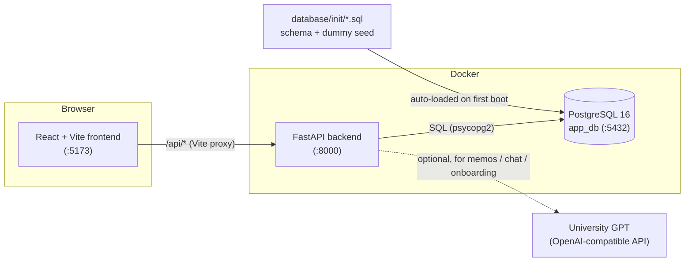
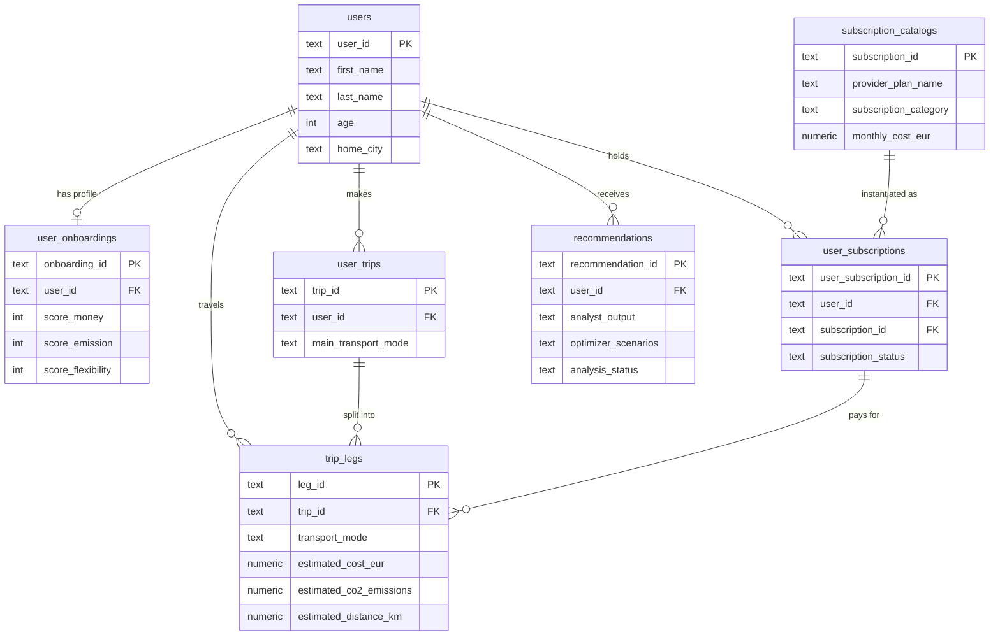
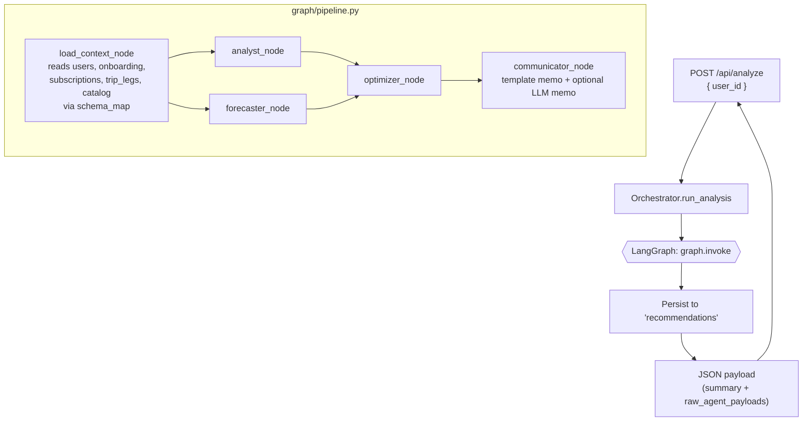
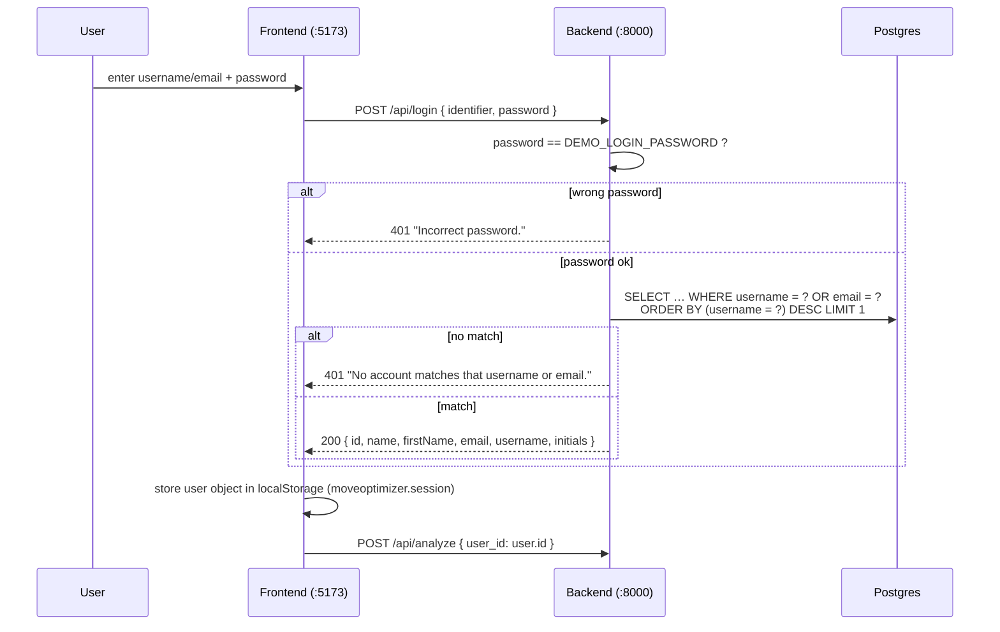
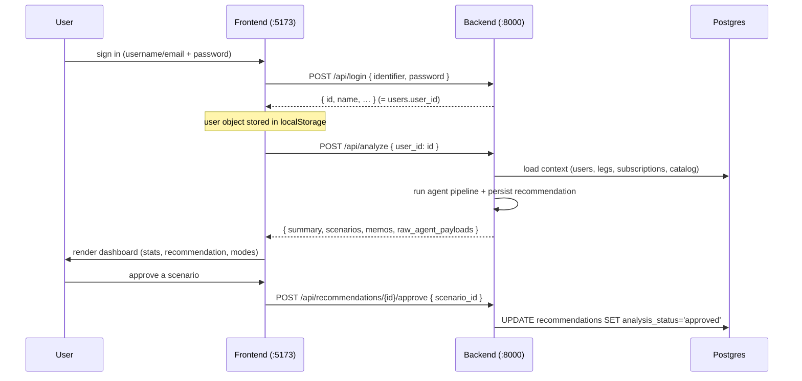

# DB MoveOptimizer — Backend

The backend is a **FastAPI** service that powers a mobility‑subscription advisor.
It loads a customer's mobility data from **PostgreSQL**, runs a **multi‑agent
LangGraph pipeline** to audit spending, forecast demand, optimise the
subscription portfolio and write a customer‑facing memo, and returns a single
JSON payload that the **React frontend** renders as a dashboard.

This document explains how the three moving parts — **data, backend, frontend** —
fit together.

---

## 1. Big picture



* The frontend never talks to Postgres directly — it only calls the backend's
  `/api/*` HTTP endpoints (proxied by the Vite dev server).
* The backend owns all data access and all business logic.
* The database **schema and seed data are provisioned by Postgres itself** from
  `database/init/*.sql`; the backend does not create tables.
* The LLM is **optional**. Without an API key the app still works — memos fall
  back to deterministic templates, and chat/onboarding return `503`.

Everything runs via `docker-compose.yml` at the repo root (start with `./run.sh`).

---

## 2. Tech stack

| Concern | Choice |
| --- | --- |
| Web framework | FastAPI + Uvicorn (`src/main.py`) |
| Agent orchestration | Deterministic pipeline (`src/agent/pipeline.py`) + single-call grounded Analyst memo (`src/agent/analyst_agent.py`) + ReAct chat (`src/agent/communicator_agent.py`) |
| LLM access | LangChain + `langchain-openai`, pointed at University GPT (`src/agent/llm.py`) |
| Database driver | `psycopg2` (`src/database.py`) |
| Database | PostgreSQL 16 (Docker service `db`, database `app_db`) |
| Runtime | Python 3.12 (`backend/dockerfile`) |

Dependencies live in [`requirements.txt`](requirements.txt).

---

## 3. Directory layout

```
backend/
├── dockerfile            # python:3.12-slim, runs `python src/main.py`
├── requirements.txt
├── requirements-dev.txt  # test-only deps (pytest); baked into the image
├── pytest.ini            # pythonpath = src ; testpaths = tests
├── tests/                # fast, deterministic unit + smoke tests (no DB, no LLM) — see §11
└── src/
    ├── main.py           # FastAPI app + all HTTP endpoints
    ├── orchestrator.py   # Session/persistence layer over the agent pipeline
    ├── database.py       # Postgres connection helper (get_connection / ping_db)
    └── agent/            # Unified agent package (replaces the old agents/ + graph/)
        ├── llm.py            # University GPT client + llm_available()
        ├── schema_map.py     # Adapters: production schema  ->  agent vocabulary
        ├── context.py        # load_context(user_id): DB read shaping the agent context
        ├── pipeline.py       # deterministic /analyze driver (numbers guaranteed)
        ├── analyst_agent.py  # Analyst: one grounded LLM call over pipeline's numbers + tariff docs, writes memo
        ├── communicator_agent.py  # customer chat advisor (ReAct + tool use)
        ├── engines/          # Deterministic compute — the authoritative numbers
        │   ├── analysis.py       # audits travel history + subscriptions
        │   ├── forecasting.py    # 90-day demand forecast (LLM + deterministic fallback)
        │   ├── optimization.py   # simulates subscription portfolios
        │   └── memo.py           # drafts the EN/DE memo (template baseline)
        ├── tools/            # tools the agents call
        │   ├── catalog.py        # lookup_subscriptions tool (reads catalog)
        │   └── knowledge.py      # OKF tariff RAG: list_tariff_docs / read_tariff_doc
        └── prompts/          # Analyst + Communicator system prompts
```
Note: onboarding was removed. The tariff knowledge base (OKF `index.md` + docs) lives in
`data/Markdownfiles Abos/`.

---

## 4. The data layer

### 4.1 Where the schema comes from

The production schema lives in **`database/init/*.sql`** (repo root, **not** in
this folder). `docker-compose.yml` mounts that directory into the Postgres
container's `/docker-entrypoint-initdb.d`, so Postgres runs every `.sql` file in
filename order **the first time the data volume is created**. The backend's only
startup responsibility is to confirm the DB is reachable (`ping_db()` in
`src/database.py`).

> ⚠️ Init scripts only run on a **fresh** volume. To re-apply schema/seed changes:
> `docker compose down -v && docker compose up`.

### 4.2 Schema overview



Key facts the backend relies on:

* **Preferences** are 0–100 scores on `user_onboardings`
  (`score_money`, `score_emission`, `score_flexibility`) — not a JSON blob.
* **Cost, CO₂, distance and mode live at the `trip_legs` level**, not on the trip.
  A trip is a journey; its legs are the individual segments that actually carry
  the money/carbon. The backend treats each **leg** as a unit of "travel history".
* **Subscriptions** are split: `subscription_catalogs` is the product catalog;
  `user_subscriptions` is which products a user holds.
* **`recommendations`** stores each analysis run's agent outputs as JSON.

### 4.3 The dummy user

`database/init/99_seed_dummy_user.sql` seeds exactly one fully‑formed user,
`dummy-user-001` ("Test User", Berlin, holds a Deutschlandticket), spanning every
table. This is the user the frontend logs in as. The numbered prefix (`99_`)
ensures it runs after all `CREATE TABLE`s.

---

## 5. The domain helpers (`schema_map.py`)

The deterministic agents compute over the **production schema natively** — the full
transport‑mode taxonomy, trips/legs, and the generic `subscription_catalogs`. They
do not translate the data into a simplified vocabulary on input. `schema_map.py`
holds only the small amount of shared domain knowledge they need:

| Helper | Purpose |
| --- | --- |
| `group_mode()` | collapse the 11 production transport modes into the frontend's display buckets (`train`/`bus`/`car`/`bike`/`scooter`/…) — applied only when shaping `mode_breakdown` for the UI |
| `category_covers_mode()` | the **coverage assumption**: which transport modes a subscription category pays for (`public_transport` covers `public_transport`+`regional_train`; `car_sharing` covers `car_sharing`; etc.). This is the generic replacement for the old hardcoded product logic |
| `preferences_from_onboarding()` | `score_money/emission/flexibility` → `cost_priority` / `co2_priority` / `convenience_priority` |
| `clean_row()` / `jsonable()` | coerce psycopg2 `Decimal` / `datetime` → `float` / ISO string (so agent math and `json.dumps` don't break) |

**Coverage & cost model.** A leg's `estimated_cost_eur` is its *intrinsic*
pay‑as‑you‑go price. A subscription covers a leg when its category covers the leg's
transport mode — a covered leg then costs €0. The optimizer values every portfolio
(including the user's current one) through the same `simulate()` against these
intrinsic prices, so adding or dropping a plan is symmetric.

---

## 6. The analyze pipeline (the heart of the system)

`POST /api/analyze` is where data, agents and LLM come together. The
**Orchestrator** (`orchestrator.py`) invokes a **LangGraph** (`graph/pipeline.py`),
then persists the result and shapes the response the frontend expects.



What each node does:

| Node | Reads | Produces |
| --- | --- | --- |
| `load_context` | `users`, `user_onboardings`, `user_subscriptions ⋈ subscription_catalogs`, `trip_legs`, `subscription_catalogs` | catalog‑native context (user, preferences, subscriptions, leg‑level travel history, catalog) |
| `analyst` | travel history + subscriptions | spend audit, grouped mode breakdown, **generic** coverage‑based inefficiencies (unused / missing subscription) |
| `forecaster` | travel history | projected 6‑month demand by mode |
| `optimizer` | history + subscriptions + catalog + preferences | **catalog‑driven** ranked **scenarios** (cost‑optimized + balanced): any catalog plan is a candidate, costed via `category_covers_mode` + flat price — no hardcoded products |
| `communicator` | analyst + optimizer output | EN/DE memo — deterministic template, upgraded to an **LLM‑written** memo when a key is configured |

The agents are **deterministic** — they are the authoritative source of every
number the dashboard shows. The LLM only rewrites prose (the memo); if it is
absent or errors, the template memo stands.

After the graph runs, the orchestrator inserts a row into `recommendations`
(`analyst_output`, `forecaster_output`, `optimizer_scenarios`, `analysis_status =
'ready'`) and returns a payload shaped like:

```jsonc
{
  "session_id": "…",            // = recommendation_id
  "status": "ready",
  "customer_name": "Test User",
  "preferences": { … },
  "current_subscriptions": [ … ],
  "summary": {
    "baseline_cost": 588.0,
    "baseline_co2": 0.5,
    "recommended_scenario": "A",
    "scenarios": [ … ],
    "memos": { "english": "…", "german": "…" }
  },
  "raw_agent_payloads": { "analyst": …, "forecaster": …, "optimizer": …, "communicator": … }
}
```

---

## 7. HTTP API

All endpoints are defined in `src/main.py`.

| Method & path | Purpose | Notes |
| --- | --- | --- |
| `GET /` | health/info | — |
| `POST /api/login` | authenticate a user by username/email + shared password | body `{ "identifier": "…", "password": "…" }`; returns the session user object, else `401`. See §8a |
| `GET /api/personas` | list DB users + onboarding prefs + subscriptions | reads the production schema directly |
| `POST /api/analyze` | run the 4‑agent pipeline for a user | body `{ "user_id": "…" }`; persists a `recommendations` row |
| `POST /api/recommendations/{id}/approve` | mark a recommendation approved | body `{ "scenario_id": "A" }`; sets `analysis_status='approved'`, `selected_scenario_id`, `approved_at` |
| `POST /api/chat` | conversational advisor (ReAct + catalog tool) | **requires** an LLM key, else `503` |
| `POST /api/onboarding` | conversational onboarding → writes a new user | **requires** an LLM key, else `503`; writes `users` + `user_onboardings` + `user_subscriptions` |

---

## 8a. Login & authentication

> **Naming note.** Despite being referred to as the "OAuth login", this is **not
> OAuth** — there is no external identity provider, no token grant flow and no
> JWT. It is a deliberately minimal **shared-password credential login** against
> the real database users, suitable for the sandbox/demo. The `users` table
> already carries an `external_auth_id` column, which is the natural hook for a
> real OAuth/OIDC integration later (see "Upgrading to real OAuth" below).

### Why it exists

The frontend used to log in as a single hardcoded persona (`dummy-user-001` in
`frontend/src/data/personas.js`). After the seed data was replaced with 23 real
users, that persona no longer existed, so every login posted a missing `user_id`
to `/api/analyze` → `404` → "We couldn't load your plan". The login was
restructured into a real **username/email + password** sign-in against the seeded
users; the quick-start persona buttons and `personas.js` were removed.

### The flow



### Contract

`POST /api/login` (defined in `src/main.py`):

* **Request:** `{ "identifier": "<username or email>", "password": "<password>" }`
* **Auth rule:** the `password` must equal `DEMO_LOGIN_PASSWORD` (a single shared
  secret read from the environment, default `mobility`). It is **not** stored
  per-user — the seed data has no password column.
* **Lookup:** the identifier is matched against `username` **first**, then `email`
  (`ORDER BY (username = ?) DESC`). Usernames are unique; emails may collide, so
  username-first keeps logins deterministic.
* **Success (200):** the compact session object the frontend stores and reuses —
  `id` (= `users.user_id`, the key for every later `/api/analyze` call), `name`,
  `firstName`, `email`, `username`, `initials`.
* **Failure (401):** `"Incorrect password."` (bad password) or
  `"No account matches that username or email."` (unknown identifier). The
  frontend surfaces `detail` directly in the form's error banner.

### Frontend wiring

| Concern | Location |
| --- | --- |
| API call (resolves, not throws, on 401) | `frontend/src/api/client.js` → `login()` |
| Session state + `localStorage` persistence | `frontend/src/context/AuthContext.jsx` |
| Sign-in form (identifier + password) | `frontend/src/pages/Login.jsx` |

The full user object is persisted to `localStorage` under
`moveoptimizer.session`, so a page reload restores the session; `logout()` clears
it. There is no server-side session — the backend treats every request as
stateless and trusts the `user_id` the frontend sends.

### Try it

```bash
# success (use a user that has travel data so the dashboard is non-empty)
curl -X POST localhost:8000/api/login \
     -H 'Content-Type: application/json' \
     -d '{"identifier":"jank_frankfurt","password":"mobility"}'

# email also works
curl -X POST localhost:8000/api/login \
     -H 'Content-Type: application/json' \
     -d '{"identifier":"jan.klein@example.com","password":"mobility"}'

# wrong password / unknown user -> 401
curl -i -X POST localhost:8000/api/login \
     -H 'Content-Type: application/json' \
     -d '{"identifier":"jank_frankfurt","password":"nope"}'
```

### Security caveats (demo only)

* One shared password for everyone; credentials are checked in plaintext.
* `401` messages distinguish "wrong password" from "unknown user" (a minor user
  enumeration leak) — acceptable for a sandbox, not for production.
* No tokens/sessions: any client that knows a `user_id` can call `/api/analyze`
  for it.

### Upgrading to real OAuth

To make this genuine OAuth/OIDC: add an identity provider (e.g. an OAuth2
authorization-code flow), store the provider's subject in the existing
`users.external_auth_id` column, exchange the provider token for a backend
session/JWT, and replace the `DEMO_LOGIN_PASSWORD` check in `/api/login` with
token verification. The frontend's `AuthContext` would store the issued token
instead of the user object, and protected endpoints would validate it.

---

## 8. The LLM layer (optional, graceful)

`agent/llm.py` is the single point that knows how to reach **University GPT**
(an OpenAI‑compatible endpoint) and whether it is configured:

* `llm_available()` is `True` only when `UNI_GPT_API_KEY` is set.
* `get_llm()` lazily builds a shared `ChatOpenAI` client.

Degradation when no key is present:

| Feature | With key | Without key |
| --- | --- | --- |
| `/api/analyze` memo | LLM‑written EN/DE memo | deterministic template memo |
| `/api/chat` | works | `503` (frontend uses a scripted fallback) |
| `/api/onboarding` | works | `503` |

So the core analyze/persona/approve flow is **fully functional with no API key**.

---

## 9. How the frontend connects



* Login is handled by `POST /api/login` (see §8a). The returned `id` is the
  `users.user_id` used for every subsequent `/api/analyze` call; the user object
  is held in `AuthContext` and `localStorage`. The old hardcoded
  `frontend/src/data/personas.js` has been removed.
* In dev, the Vite server proxies `/api/*` to the backend (`vite.config.js`), so
  the browser only ever calls same‑origin `/api/...`.
* CORS is wide‑open in `main.py` (`allow_origins=["*"]`) for development.

---

## 10. Running & configuring

```bash
# from the repo root
./run.sh                     # = docker compose up --build

# reset the database (re-runs database/init, including the dummy seed)
docker compose down -v && docker compose up --build
```

Services: frontend `:5173`, backend `:8000`, Postgres `:5432`.

### Environment variables

| Variable | Default | Used by |
| --- | --- | --- |
| `DATABASE_URL` | `postgresql://postgres:postgres@db:5432/app_db` (set in compose) | `database.py` |
| `DEMO_LOGIN_PASSWORD` | `mobility` | `main.py` — shared password accepted by `POST /api/login` (§8a) |
| `UNI_GPT_API_KEY` | _(empty)_ | `agent/llm.py` — enables memos/chat/onboarding |
| `UNI_GPT_BASE_URL` | `https://chat.kiconnect.nrw/api/v1` | `agent/llm.py` |
| `UNI_GPT_MODEL` | `OpenAI GPT OSS 120b KI:Inferenz.nrw` | `agent/llm.py` |

The API key is read from the repo‑root `.env` (mounted via compose `env_file`).

### Quick smoke test

```bash
curl localhost:8000/                                   # health
curl localhost:8000/api/personas                       # -> 23 seeded users
curl -X POST localhost:8000/api/login \
     -H 'Content-Type: application/json' \
     -d '{"identifier":"jank_frankfurt","password":"mobility"}'   # -> session user object
curl -X POST localhost:8000/api/analyze \
     -H 'Content-Type: application/json' \
     -d '{"user_id":"c3d4e5f6-cccc-dddd-eeee-ffff22223333"}'      # -> full pipeline payload
```

---

## 11. Testing

A fast, **deterministic** pytest suite covers the engines (the authoritative numbers) plus an
import/route smoke test. It touches **no database and no LLM** — the LLM path in `forecast()`
is forced off with `monkeypatch.setattr("agent.llm.llm_available", lambda: False)` — so it runs
in well under a second and needs no API key or running Postgres.

```
backend/
├── pytest.ini            # pythonpath = src (so tests import `agent.*`, `main`, …); testpaths = tests
├── requirements-dev.txt  # pytest — installed into the image by the dockerfile
└── tests/
    ├── conftest.py           # shared pure-dict fixtures shaped like load_context()'s output
    ├── test_schema_map.py    # group_mode / category_covers_mode / preferences_from_onboarding / coercion
    ├── test_analysis.py      # analyze_portfolio: contract keys, trip windowing, realized savings, reproducibility
    ├── test_optimization.py  # optimize: A/B scenarios, savings == baseline − cost, empty-catalog resilience
    ├── test_memo.py          # template_memos: keys, EN/DE non-empty, savings_potential_estimate_eur regression guard
    ├── test_forecasting.py   # forecast (deterministic path): shape, recent-month weighting, calendar-not-analyzed note
    └── test_imports.py       # SMOKE NET: each handler's (lazy) imported symbol exists + key routes are registered
```

**Why the smoke test matters.** `test_imports.py` asserts that every symbol the FastAPI
handlers import — including lazy in-handler imports like `from agent.communicator_agent import
run_chat` — still exists, and that the key routes are registered on `app`. This catches the
class of bug where an endpoint 500s only when actually called (exactly the `/api/chat`
regression that occurred when `run_chat` was overwritten): a plain `import main` would not
surface a missing lazy import, but this test does.

### Running the tests

The dev deps are baked into the image (`dockerfile` installs `requirements-dev.txt`), so run
them in the backend container:

```bash
docker compose exec backend pytest -q          # all tests
docker compose exec backend pytest -q tests/test_optimization.py   # one module
docker compose exec backend pytest --collect-only                  # list what would run
```

To run locally instead (from `backend/`, with the app deps installed):

```bash
pip install -r requirements.txt -r requirements-dev.txt
pytest -q
```

`pythonpath = src` in `pytest.ini` is what lets the tests do `from agent.engines import …` and
`import main` without any sys.path juggling. Importing `main` is DB-safe: `ping_db()` runs only
inside the FastAPI lifespan, not at import time.

**Scope (deliberately).** Engines + import/route smoke only. DB-integration tests for
`load_context`/persistence (need a Postgres test fixture), FastAPI `TestClient`
request/response tests, and CI wiring are future work.

---

## 12. Notes / known limitations

* **Connection-per-request.** Each endpoint opens and closes its own psycopg2
  connection (`get_connection` retries while Postgres warms up). Fine for the demo;
  a pool would be the next step for production.
* **Legacy SQLite `?` placeholders.** `database.py` wraps the cursor
  (`_CompatCursor`) to rewrite `?` → `%s`, so the original SQLite‑style queries
  keep working against Postgres.
* **Optimizer is catalog‑driven, flat‑rate only.** Any plan in
  `subscription_catalogs` is a candidate and is costed via its flat
  `monthly_cost_eur`/`annual_cost_eur` plus the `category_covers_mode` coverage
  rules — there are no hardcoded products. **Usage‑based pricing**
  (`per_km` / `per_minute` / `time_pass` / `hybrid`) is **deferred**: the catalog
  has no rate columns yet. Adding a rate schema + a per‑leg pricing engine is the
  natural next step; `OptimizerAgent.simulate()` is the single extension point.
* **CO₂ savings are conservative** (accepted Phase‑1 simplification, AMB‑02). Flat
  plans don't shift emissions in the current model, so `co2_savings_kg` is 0 —
  CO₂ is baseline‑reporting only and does not differentiate scenarios (hence there
  is no separate "Sustainability" scenario). A mode‑shift model is future work.
* **Ranking is cost‑and‑coverage only** (accepted Phase‑1 simplification, AMB‑03).
  Scenarios are ordered by `(total_cost, -covered_count)`. The onboarding preference
  scores (`cost_priority` / `co2_priority` / `convenience_priority`) are collected and
  passed into `optimize(preferences=…)` but are **intentionally not consumed by
  ranking** in Phase 1. A weighted/shadow‑price score is future work (coupled to the
  CO₂ mode‑shift model above). See `DELIVERABLES/requirements_ambiguity_analysis.md`.
* **Coverage is an assumption.** `category_covers_mode` encodes which modes each
  subscription category pays for (e.g. a public‑transport pass does *not* cover
  long‑distance rail). Tune it in `schema_map.py` if the product rules change.
* **One demo user.** The login is wired to the single `dummy-user-001`. Adding
  users means seeding the DB and extending `frontend/src/data/personas.js` (or
  switching the login to read `GET /api/personas`).
