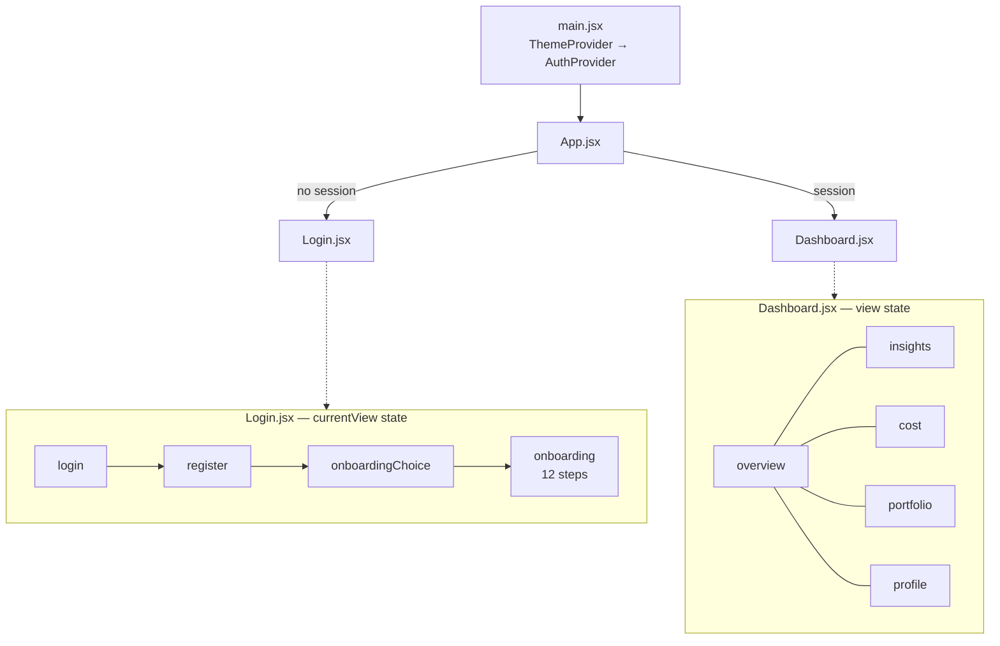
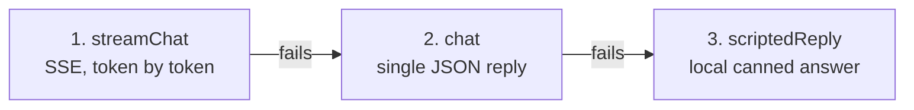

# Frontend — React + Vite dashboard

The frontend is the customer-facing surface of the mobility advisor. It signs a
user in, calls `POST /api/analyze`, and renders the result as a dashboard:
current spend, per-category subscription recommendations, travel insights, and a
chat advisor that can explain and apply changes.

> [!NOTE]
> Setup and Docker commands are in the [root README](../README.md). The API this
> talks to — routes, request and response shapes — is documented in
> [`backend/README.md`](../backend/README.md).

---

## Tech stack

| Concern | Choice |
| --- | --- |
| Framework | React 18 |
| Build / dev server | Vite 5 |
| Icons | `lucide-react` |
| Routing | **none** — hand-rolled view state (see below) |
| State management | **none** — React context + `useState` |
| Charts | **none** — hand-written SVG (`components/insights/`) |
| Markdown | **none** — hand-written renderer (`components/chat/Markdown.jsx`) |
| Styling | plain CSS with custom properties (`styles/tokens.css`) |

The dependency list is deliberately tiny: React, React DOM and an icon set. No
router, chart library, state manager or CSS framework. Everything else is in the
repository, which keeps the build fast and the bundle small but means the
hand-rolled pieces are yours to maintain.

---

## Architecture

### There is no router

Navigation is two nested switches rather than URL routing:



1. [`App.jsx`](src/App.jsx) renders `Login` or `Dashboard` depending on whether
   `AuthContext` holds a session. It keys the wrapper on the auth state so the
   view remounts and fades in on sign-in.
2. [`Dashboard.jsx`](src/pages/Dashboard.jsx) holds a `view` state —
   `'overview' | 'insights' | 'cost' | 'portfolio' | 'profile'` — and renders the
   corresponding page component inline.
3. [`Login.jsx`](src/pages/Login.jsx) holds its own `currentView` state for the
   sign-in, registration and onboarding flow.

> [!IMPORTANT]
> Because there are no URLs, the browser back button does not move between
> views and no view is directly linkable. A page reload always returns to
> `overview` (or the login screen). This is a deliberate trade-off for a demo;
> introducing `react-router` would be the fix if deep links are ever needed.

### Directory layout

```text
frontend/
├── dockerfile              # node:22-bookworm-slim, runs the Vite dev server
├── vite.config.js          # /api proxy to the backend
└── src/
    ├── main.jsx                # entry: ThemeProvider → AuthProvider → App
    ├── App.jsx                 # login-vs-dashboard switch
    ├── api/client.js           # every backend call lives here
    ├── context/
    │   ├── AuthContext.jsx     # session state + localStorage persistence
    │   └── ThemeContext.jsx    # dark/light theme
    ├── pages/
    │   ├── Login.jsx           # sign-in + registration + 12-step onboarding
    │   ├── Dashboard.jsx       # shell, view switching, analysis fetch
    │   ├── TravelInsights.jsx  # travel patterns over time
    │   ├── CostBreakdown.jsx   # spend by category and mode
    │   ├── PortfolioDetail.jsx # per-category recommendations and actions
    │   └── ProfileEdit.jsx     # profile and mobility-account editing
    ├── components/
    │   ├── AppShell.jsx        # page frame
    │   ├── StatCards.jsx       # headline figures
    │   ├── RecommendationCard.jsx
    │   ├── TravelModes.jsx     # mode breakdown
    │   ├── Insights.jsx
    │   ├── SkeletonDashboard.jsx   # loading placeholder
    │   ├── Logo.jsx / ThemeToggle.jsx
    │   ├── chat/
    │   │   ├── ChatWidget.jsx      # the advisor panel
    │   │   ├── useChat.js          # conversation state + fallback chain
    │   │   └── Markdown.jsx        # minimal markdown renderer
    │   └── insights/
    │       ├── LineChart.jsx       # hand-written SVG
    │       └── StackedBarChart.jsx
    ├── lib/
    │   ├── format.js           # currency and number formatting
    │   ├── travelModes.js      # mode labels and icons
    │   └── mobilityAccounts.js # provider metadata
    └── styles/
        ├── tokens.css          # design tokens (DB UX-aligned)
        ├── base.css
        └── components.css
```

---

## State

Two React contexts, no store.

### `AuthContext`

Holds the signed-in user and persists it to `localStorage` under
**`moveoptimizer.session`**, so a reload restores the session. `logout()` clears
it.

There is **no server-side session** — the backend is stateless and trusts the
`user_id` the frontend sends with each request. The stored object is the one
`POST /api/login` returns: `id`, `name`, `firstName`, `email`, `username`,
`initials`. Its `id` is the `users.user_id` used for every later call.

It exposes `login()`, `logout()`, and `setSession()` — the last used after
registration to start a session without a second round trip.

### `ThemeContext`

Dark by default. Persists to `localStorage` under `mo-theme` and sets
`data-theme` on `<html>`, which the CSS custom properties in
[`styles/tokens.css`](src/styles/tokens.css) key off. Tokens follow the
Deutsche Bahn UX design system.

---

## Talking to the backend

All calls go through [`src/api/client.js`](src/api/client.js) — no component
calls `fetch` directly. Requests are same-origin `/api/...`; the Vite dev server
proxies them, so CORS never applies in development.

| Function | Endpoint |
| --- | --- |
| `login()` | `POST /api/login` — resolves rather than throws on `401` |
| `getPersonas()` | `GET /api/personas` |
| `submitOnboarding()` | `POST /api/register` |
| `completeOnboarding()` | `POST /api/onboarding/{id}/complete` |
| `getProfile()` / `updateProfile()` | `GET` / `PUT /api/profile/{id}` |
| `analyze()` | `POST /api/analyze` |
| `approve()` | `POST /api/recommendations/{id}/approve` |
| `chat()` / `streamChat()` | `POST /api/chat/{id}` and `/stream` |
| `confirmApply()` | `POST /api/chat/{id}/confirm` |
| `chatHistory()` | `GET /api/chat/{id}/messages` |
| `openingBriefing()` | `POST /api/chat/{id}` (turn 0) |
| `submitFeedback()` | `POST /api/feedback` |

---

## The chat advisor

The most intricate part of the frontend, in
[`components/chat/`](src/components/chat/).

### It survives view switches

`ChatWidget` renders through a **React portal** into an `<aside>` slot that each
view provides. The widget itself sits at a stable position in the tree, so
switching from `overview` to `portfolio` re-parents it without unmounting —
conversation state and scroll position are preserved.

### Three-tier fallback

[`useChat.js`](src/components/chat/useChat.js) degrades in order, so the widget
always answers even with no LLM key configured:



If tokens already rendered before an error, they are kept and the bubble is
simply finalized rather than replaced.

The SSE stream carries three event types: `token` (append text), `done`
(carries `trace_id`), and `confirm_required` (carries a pending action payload).

### The confirmation gate

When the advisor wants to apply a subscription change it pauses and emits
`confirm_required`. While `pending` is set the composer is locked: the next user
action resolves through `POST /api/chat/{id}/confirm`, never as a new free-text
message. This is the human-in-the-loop gate — the model cannot change a
subscription on its own.

### Feedback

Assistant messages carry a `traceId` when they came from a real LLM reply. That
enables the 👍/👎 buttons, which call `POST /api/feedback` so the score attaches
to the right Langfuse trace. Scripted fallback replies have no `traceId` and
show no buttons. See [`backend/eval/README.md`](../backend/eval/README.md).

---

## Development

The container runs the Vite dev server with hot module replacement, and
`frontend/` is bind-mounted, so edits are live. From the repo root:

```bash
./run.sh                              # start everything
docker compose logs -f frontend       # tail the dev server
docker compose build --no-cache frontend   # force a rebuild
```

To run against a backend on the host instead of in Docker:

```bash
cd frontend
npm install
npm run dev
```

> [!WARNING]
> **The port differs between the two.** `vite.config.js` sets `port: 3000`, but
> the Dockerfile's `CMD` overrides it with `--port 5173`. So the app is on
> **5173 under Docker** and **3000 with a bare `npm run dev`**. The Docker
> command also binds `--host 0.0.0.0`; without that the server would not be
> reachable from outside the container.

### The API proxy

[`vite.config.js`](vite.config.js) proxies `/api` to `BACKEND_URL`, which
docker-compose sets to `http://backend:8000` (the Compose service name). Outside
Docker it falls back to `http://localhost:8000`.

### Other scripts

```bash
npm run build      # production build to dist/
npm run preview    # serve the production build
npm run lint       # eslint, zero-warnings policy
```

> [!NOTE]
> `npm run lint` is configured with `--max-warnings 0`, but no ESLint config
> file is committed, so the script will not run as-is. Adding an
> `eslint.config.js` is open work.

---

## Known issues and cleanup

- **`pickRec()` in `useChat.js` always returns `null`.** It reads
  `result?.summary?.scenarios`, but `Dashboard.jsx` passes `actions.optimize` as
  `() => summary?.category_subscription_analysis || []` — an array with no
  `.summary`. The lookup silently yields `null`, so every scripted-fallback
  answer that depends on a recommendation degrades. It only shows up when both
  the streaming and JSON chat paths have already failed, which is why it has
  gone unnoticed. This is the one live bug in this list.
- **`RecommendationCard.jsx` is dead code.** It renders `summary.scenarios` and
  `summary.recommended_scenario`, neither of which the backend emits any more,
  and nothing imports it. Delete it or port it to
  `category_subscription_analysis`.

> [!NOTE]
> Most of the frontend has already migrated off the old scenario shape —
> `Dashboard.jsx`, `StatCards.jsx`, `CostBreakdown.jsx` and `TravelInsights.jsx`
> all read the current fields. Only the two items above still lag.
> `PortfolioDetail.jsx`'s `forecaster.scenarios` is a *different* field that the
> forecaster genuinely emits — leave it alone.
- **`src/data/` is an empty leftover** from the removed `personas.js` and can be
  deleted.
- **A password-less persona login still exists.** `AuthContext` exposes
  `loginAs(personaId)`, which starts a session straight from `GET /api/personas`
  with no credential check. Its comment says "6 seed users" where there are now
  10. If it is no longer wanted in the demo, remove it along with `personas`.
- **`Login.jsx` is ~1,800 lines** and carries the sign-in, registration and all
  12 onboarding steps with inline styles. Splitting the onboarding steps into
  their own components is the obvious refactor.
- **Mixed-language comments.** Source comments are part German, part English.
- **No tests.** There is no frontend test setup; the backend suite covers the
  API only.
